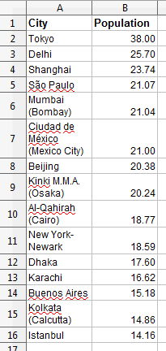
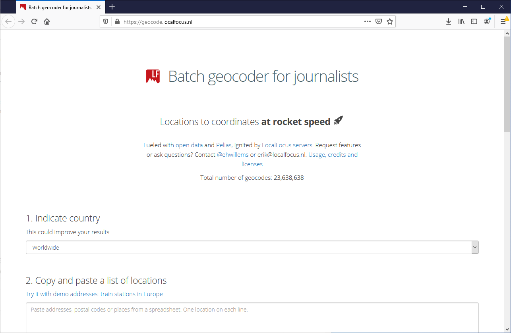
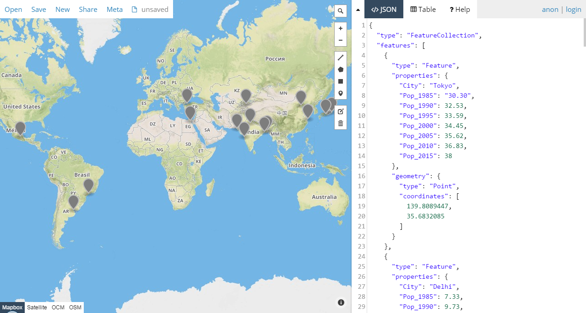
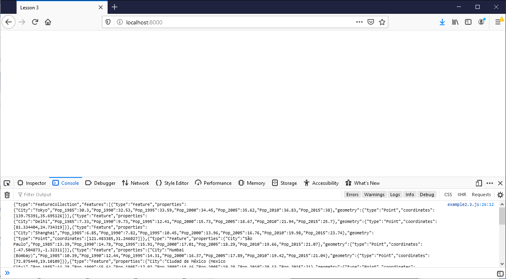
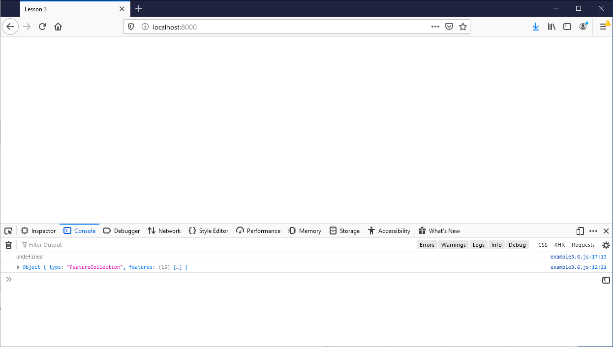
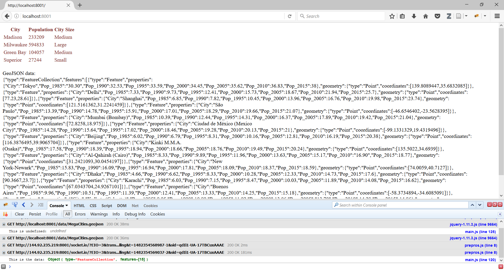

### [Return Home](../../../) | [Previous Chapter](../Chapter02) | [Next Chapter](../Chapter04)

Chapter 3: Data and AJAX
=======================

Chapter 3 is all about data, inching us one step closer to making your first interactive web map in the next chapter! Chapter 3 includes three lab lessons and ends with Activity 4, a second debugging exercise to continue to practice your computational thinking skills.

*   In Lesson 1, we introduce common web data formats and their geospatial variants.
*   In Lesson 2, we introduce AJAX (Asynchronous JavaScript and XML), or the strategy used to load data dynamically into the browser, enabling interactivity with maps and visualizations.
*   In Lesson 3, we demonstrate how to employ AJAX through callback functions.

After this chapter, you should be able to:

*   Correctly format geospatial data in CSV and JSON formats
*   Write an AJAX call to retrieve data using `jQuery.ajax()`
*   Write an AJAX callback function that adds data to the DOM

Lesson 1: (Geo)Web Data Formats
-------------------------------

### I. Geospatial Data

**_Geospatial data_** are explicitly referenced to a coordinate system representing the Earth's surface. Geospatial data can be in a _**vector**_ (representing "objects" as combinations of coordinate nodes and arcs between nodes) or _**raster**_ (representing a "field" as a regularly-spaced lattice or grid) format. Spatial often is described as "special" because spatial topology is meaningful, with near features more likely to be similar than distant features. 

Geospatial data therefore cannot be treated as simple X,Y or Cartesian coordinates, but instead need to be [projected](https://gistbok.ucgis.org/bok-topics/map-projections) onto a distorted, flat surface of the otherwise three-dimensional Earth. As we discuss later in the semester when introducing non-spatial data formats and their associated visualization techniques, the importance of coordinate systems, spatial typology, and projections makes maps perhaps the most difficult form of information visualization (i.e., _cartographers easily can design non-map visualizations, but data scientists without spatial training often struggle to make effective maps_!). 

When making static maps, we rely primarily on **_shapefiles_** (extension **_.shp_**), a very common geospatial format developed by Esri for its proprietary products. Shapefiles are not optimized for the web, as they comprise multiple files of different formats (e.g., .prj, .dbf), some that can be read by a text editor (and thus web browser) and others that cannot. Thus, the first step in web mapping often is converting shapefiles into a simpler web format (details below).

There are a number of options of web data formats that can be used for interactive maps. For instance, _**KML** (**Keyhold Markup Language**_) is an extension of _**XML**_ (_**eXtensible Markup Language**_) popularized by Google for its Google Earth and Google Maps APIs. While XML remains popular on the web (it is the X in AJAX, as introduced below!), contemporary web mapping is shifting to JSON-based formats (introduced below) that are more easily interpreted through the DOM. In Lesson 1, we first introduce CSV data, perhaps the simplest form of geospatial data that is acceptable for mapping vector points, and then discuss the more complex JSON-based formats used for mapping lines and polygons.

If you are not familiar with geospatial data, we recommend reading background on common [vector](https://gistbok.ucgis.org/bok-topics/vector-formats-and-sources) and [raster](https://gistbok.ucgis.org/bok-topics/raster-formats-and-sources) formats. We primarily use vector formats in this workbook, but will load raster tilesets as basemaps in Unit 2.

### II. CSV Data

_**CSV**_ (extension .csv) stands for _**comma-separated values**_. Like the name implies, a CSV is a matrix of values with a header row. Values are separated by commas along the horizontal axis and by invisible newline characters at the end of the row. Thus, CSVs typically are viewed in spreadsheet form, and can be created and edited through Microsoft Excel, Google Sheets, or other spreadsheet software.

Say you want to tell a story about the growth of the world's largest cities. You can start by building a CSV spreadsheet of the top cities and their populations (Figure 1.1):

###### Figure 1.1: A correctly formatted spreadsheet table (Source: United Nations)

Each geographic feature (a city) occupies one row, and the attribute data (population) is stored in a column or field, just as in the attribute table of a shapefile.

If we want to tell a story about urban _growth_, we need more than one population data capture for each city. The expanded spreadsheet  includes the urban populations at five-year time intervals from 1985 to 2015 (Figure 1.2). 

###### Figure 1.2: A CSV with multiple sequential, numeric attributes (Source: United Nations)

The Figure 1.2 spreadsheet is just attributes and does not yet contain geospatial coordinates. Given the world scale of the map, each city should be represented as a point at its geographic center. You can use an internet search engine to find latitude and longitude values for each feature, but a faster and easier way to do so is to use a **_batch geocoder_**. Figure 1.3 uses the [Local Focus](https://geocode.localfocus.nl/) batch geocoder, one in a number of options available online. Leave "country" set to Worldwide, and simply copy the first column of your spreadsheet and paste it into the input box. Hit "Add to Geocoder" and see your results below.

###### Figure 1.3: The Local Focus Geocoder: https://geocode.localfocus.nl/

The Local Focus geocoder attempts to disambiguate all text strings into geographic coordinates. Some names may produce multiple coordinates, with Local Focus allowing you to select the correct location. You also can flag incorrectly geocoded coordinates using the "X" button and manually add the coordinates to your CSV later based on an internet search. Notice that the interactive map displaying the results is built with Leaflet, the Javascript library we will start learning next chapter! Importantly, set your text results to "Decimals with dots", copy the final results, and paste them into a spreadsheet.

###### Figure 1.4: Results from the geocoder

The geocoded output includes _**latitude**_ (the "Y" value north and south from the equator) and _**longitude**_ (the "X" value east and west from the prime meridian in Greenwich) columns. Many programs and websites recognize CSV data as geospatial if it contains these two column headers, so it is a good idea to always use these names for your coordinate columns. Note that the coordinate values are in **_decimal degrees_**, with positive values denoting north latitude or east longitude and negatives denoting south/west.

Your final spreadsheet should have the name, lat/long coordinates, and population data for each city (Figure 1.5)  Once the spreadsheet is ready, save it using the ._csv_ option to your _Chapter03_ _data_ folder (within your _unit-1_ repository). _Note_: Choose "UTF-8" for the character encoding when saving to ensure all characters are universally recognized.

Additionally, copy the contents from _Chapter02_ to _Chapter03_. Doing so will allow you to access everything that you copied from _boilerplate_ to _Chapter02_, as well as build on the script that you began writing in Chapter 2.

###### Figure 1.5: Georeferenced data

> **Open _MegaCities.csv_ located in _Chapter03_ of the _unit-1_ folder. Run its contents through a batch geocoder to add latitude and longitude columns. Fill in any missing coordinate values.**

### II. JSON and GeoJSON

_**JSON**_, or _**JavaScript Object Notation**_, is an alternative data format native to JavaScript and the Open Web that stores data as one long JavaScript object for referencing and manipulation in the DOM. JSON keys are strings and the values may be strings, numbers, arrays, or other objects.

_**GeoJSON**_ was invented to take advantage of JSON syntax for geospatial data. GeoJSON is to JSON as KML is to XML; while JSON may use any arbitrary keys and values, the GeoJSON specification requires particular keys and data types. Like a shapefile, GeoJSON uses a spaghetti model for geometry, with no topology or shared polygon boundaries (more about this when we introduce TopoJSON for D3 in Chapter 8).

You can convert a CSV or KML to GeoJSON using [geojson.io](http://geojson.io/). You can convert shapefiles to GeoJSON using the [MapShaper tool](https://mapshaper.org/). Starting with geojson.io, upload your dataset by dragging the file into the browser. If it is correctly formatted, the application will recognize the geography instantly and display a point marker for each city (Figure 1.6).

###### Figure 1.6: MegaCities.csv displayed in geojson.io

Note that data appears in GeoJSON format in the right-side panel. There are no variables defined here, just the JSON object beginning with an opening curly brace on the first line. The first key is `"type"`, which has the value `"FeatureCollection"`; this indicates the data is a GeoJSON. There then is an array of `"features"`, each with its own object with a `"type"` (`"Feature"`), an object called `"properties"` containing the feature attributes, and a `"geometry"` object with the geometry `"type"` (`"Point"`) and a two-value `"coordinates"` array. Note that longitude comes before latitude in this array, following the \[x, y, z\] geometry convention (the optional z value is used to represent elevation). You should familiarize yourself with this formatting, as we use it repeatedly in this workbook.

Once you have imported your data, you have two options for saving it as a GeoJSON file. If you want to keep the data neatly formatted as it is in the side panel, you can simply select all of the text in the side panel, copy it, paste into a new blank file in your text editor, and save it with a _.geojson_ extension from there. For a minified file, use the Save menu in the upper-left corner of the map and choose "GeoJSON". A file called _map.geojson_ will download automatically; retrieve this file from your downloads folder, move it to the data folder in your website directory, and rename it appropriately.

> ### **Use [geojson.io](http://geojson.io/) to convert your CSV to a GeoJSON. Save your GeoJSON file to your _data_ folder in your _Chapter03_ subdirectory.**

Lesson 2: AJAX Concepts and Syntax
----------------------------------

### I. What is AJAX?

_**AJAX**_ Stands for **_Asynchronous JavaScript and XML_**. Back in the Internet Stone Age (the 1990s), webpages were static. Any changes in content required the user to reload the web page. For instance, when MapQuest was invented, in order to pan the map from side to side, the user had to click an arrow button that would reload the entire webpage with a new section of map then shown on the reloaded page.

AJAX is the reason we can have a fluid rather than fragmented user experience, allowing data to be sent to and received from a server _asynchronously_ without reloading the webpage. AJAX enables interaction, as asynchronous data requests are executed through event listeners on interactive controls within the webpage, such as buttons, sliders, form fill-in textboxes, or the map and individual map features themselves.

### II. JavaScript AJAX Requests

JavaScript AJAX requests are somewhat complicated; they involve an entire back-and-forth conversation between the client and the server. Although you ultimately will use code libraries like jQuery for your AJAX calls for simplicity (see Lesson 3), it is conceptually useful to step through native JavaScript to gain an understanding of how AJAX works.

AJAX functions computationally in five steps. First, let's start with a simple AJAX request (Example 2.1).

###### Example 2.1: Creating a JavaScript AJAX request object in _main.js_

    function jsAjax(){
        // Step 1: Create the request 
        var ajaxRequest = new XMLHttpRequest();
    };
    
    window.onload = jsAjax();
    

The statement `new XMLHttpRequest()` creates a new instance of a special type of object that includes properties and methods meant for a particular purpose. In this case, that purpose is to communicate with a server that can supply the data we want.

We then create an event handler to send the received data to a callback function (Example 2.2). A JavaScript _**callback function**_ executes script that uses the data retrieved from a server _after the data loads into the browser_. Consequently, any script that makes use of data sent through AJAX should be written or called within the callback function to avoid manipulating the data before it is fully available in the browser.

###### Example 2.2: Creating an AJAX event handler that calls a callback function in _main.js_

    function jsAjax(){
        // Step 1: Create the request 
        var ajaxRequest = new XMLHttpRequest();
    
        //Step 2: Create an event handler to send received data to a callback function
        ajaxRequest.onreadystatechange = function(){
            if (ajaxRequest.readyState == 4){
                callback(ajaxRequest.response);
            };
        };
    };
    
    //define callback function
    function callback(response){
        //tasks using the data go here
        console.log(response);
    };
    

The `onreadystatechange` property of the `ajaxRequest` object holds an event listener that fires whenever the `readyState` of the object changes. During the request-response process, the object goes through four `readyState`s; the fourth one occurs when a response is received from the server. If you wish to see this in action in the console, you can add `console.log("readyState: ", ajaxRequest.readyState)` to the first line of the event listener handler (Line 7 in Example 2.2). The server's response—the data—is sent to the callback function defined beneath the `jsAjax()` function.

Steps 3-5 of AJAX occur in sequence: A server first is opened, then the data type of the transfer is set, and finally the AJAX request is sent (Example 2.3).

###### Example 2.3: Opening a server connection, setting the data type, and sending the AJAX request in _main.js_

    function jsAjax(){
        // Step 1: Create the request 
        var ajaxRequest = new XMLHttpRequest();
    
        //Step 2: Create an event handler to send received data to a callback function
        ajaxRequest.onreadystatechange = function(){
            if (ajaxRequest.readyState == 4){
                callback(ajaxRequest.response);
            };
        };
    
        //Step 3: Open the server connection
        ajaxRequest.open('GET', 'data/MegaCities.geojson', true);
    
        //Step 4: Set the response data type
        ajaxRequest.responseType = "json";
    
        //Step 5: Send the request
        ajaxRequest.send();
    };
    
    //define callback function
    function callback(response){
        //tasks using the data go here
        console.log(response);
    };
    
    window.onload = jsAjax();
    

The `.open()` method specifies the type of request: either `GET` for getting data from the server or `SEND` for posting data to the server. The `.open()` method also includes the URL string of the data location and a Boolean to make the request asynchronous (more on this in Lesson 3). The `responseType` property then sets the data type to JSON, but this could be CSV, XML, etc. Finally, the `.send()` method sends the full request package, including the event listener handler we created in Step 2, to the server.

If the AJAX request executes successfully, the `callback` function will print the GeoJSON to the console (Figure 2.1).

###### Figure 2.1: Theconsole showing the data request and GeoJSON object

We also can view the response as plain text using JavaScript's built-in JSON library to translate our JSON to a string (Example 2.4; Figure 2.2).

###### Example 2.4: Translating JSON to a strinng in _main.js_

        //Example 2.3 line 25...
        console.log(JSON.stringify(response));
    

###### Figure 2.2: The console showing the JSON data as a string

> ### **With your _index.html_ linked to _main.js_, print the _MegaCities.geojson_ file to the console in _main.js_ using native JavaScript functions shown in Example 2.3.**

### III. jQuery AJAX Requests

jQuery greatly simplifies AJAX requests, making it much easier to communicate between your script and the server. The primary AJAX method in jQuery is `.ajax()` (Example 2.4). Example 2.5 replaces the native AJAX calls from Example 2.3 with the `ajax()` jQuery solution.

###### Example 2.4: Example 2.4: jQuery `.ajax()` method in _main.js_

    $.ajax("data/MegaCities.geojson", {
        dataType: "json",
        success: callback
    });

###### Example 2.5: The _main.js_ script from Example 2.3 with jQuery `.ajax()` method

    //define AJAX function
    function jQueryAjax(){
        //basic jQuery ajax method
        $.ajax("data/MegaCities.geojson", {
            dataType: "json",
            success: callback
        });
    };
    
    //define callback function
    function callback(response, status, jqXHRobject){
        //tasks using the data go here
        console.log(response);
    };
    
    $(document).ready(jQueryAjax);
    

The `$.ajax()` (or `jQuery.ajax()`) method takes two parameters: a URL string defining the data location (`"data/MegaCities.geojson"`) and a settings object. The settings object in Example 2.5 only has two properties: `dataType` (`"json"`) and `success` (the `callback` function). The [API Documentation page](http://api.jquery.com/jquery.ajax/) summarizes the many other properties that can be set for `jQuery.ajax()`. Bookmark this page, as it will come in handy in the future.

jQuery also provides alias methods for `jQuery.ajax()`, listed in the API Documentation under [AJAX Shorthand Methods](https://api.jquery.com/category/ajax/shorthand-methods/). _**Alias methods**_ provide fewer configuration options but make most AJAX requests even simpler to write. The two methods in Example 2.6 execute the same instructions as the `$.ajax()` method shown in Example 2.5.

###### Example 2.6: jQuery AJAX alias methods that could be used in _main.js_

    //jQuery.get() method...Example 2.5 line 3
    $.get("data/MegaCities.geojson", callback, "json");
    
    //jQuery.getJSON() method...Example 2.5 line 3
    $.getJSON("data/MegaCities.geojson", callback);
    

> ### **Examine the API Documentation for the [`jQuery.ajax()`](http://api.jquery.com/jquery.ajax/) method and its [Shorthand Methods](https://api.jquery.com/category/ajax/shorthand-methods/) to determine the purpose each parameter serves. Then, write an AJAX script using jQuery that prints _MegaCities.geojson_ file to the console in _main.js_.**

Note that regardless of the method used, there is always a URL string that points to the data and a callback function specified within the parameters. The purpose served by the URL string should be obvious—find the data we want—but the callback function may be trickier to fully understand. Next, we will examine the reason for the callback function and how to debug the callback function in your script.

Lesson 3: Understanding AJAX Callback Functions
-----------------------------------------------

From the Codecademy tutorials in Activity 2, you know that you can pass data into a function through the parameters and then return data for storage in a variable using the `return` reserved word. When using AJAX, we could try to store the asynchronously loaded data in a global variable using `return` (Example 3.1).

###### Example 3.1: Returning data from an AJAX function in _main.js_

    //an AJAX function
    function jQueryAjax(){
        var mydata = $.ajax("data/MegaCities.geojson", {
            dataType: "json"
        });
        return mydata;
    };
    
    var mydata = jQueryAjax();
    
    console.log(mydata); //the jQuery XMLHttpRequest object
    

However, jQuery returns the full `XMLHttpRequest` object rather than the JSON data. Inspecting the properties of the `XMLHttpRequest` object in the Console (Figure 3.1), you can see that the `responseJSON` property holds our data.

###### Figure 3.1: The DOM tab showing properties of the XMLHttpRequest object

However, the data included in `mydata.responseJSON` is not immediately usable. For instance, printing `mydata.responseJSON` to the console results in an undefined error message (Example 3.2; Figure 3.2).

###### Example 3.2: Attempting to print the response data to the console in _main.js_

    //Example 3.2 line 11...
    console.log(mydata.responseJSON);
    

###### Figure 3.2: The response data is undefined?

Why is `responseJSON` undefined? Recall that we set the last parameter of the `.open()` method to `true` (Example 2.3, Line 13), meaning that we requested the data to be sent _asynchronously_. Accordingly, the browser interpreter continues executing the rest of the script while the server takes a few milliseconds to gather and send the requested data. Thus, when our `console.log` statement is executed to print the contents of `responseJSON`, the data have not arrived yet! Thus, if we tried to use `mydata.responseJSON` for any purpose before it is fully loaded—say, adding it to a web map—we receive an undefined error.

Consequently, any script that makes use of data sent through AJAX should be written or called within the callback function. Example 3.3  again shows the correct `ajax()` jQuery solution including a callback function from Example 2.5.

###### Example 3.3: Correctly accessing response using a callback function in _main.js_

    //define AJAX function
    function jQueryAjax(){
        //basic jQuery ajax method
        $.ajax("data/MegaCities.geojson", {
            dataType: "json",
            success: callback
        });
    };
    
    //define callback function
    function callback(response, status, jqXHRobject){
    
        //TASKS USING THE DATA GO HERE
        console.log(response);
    
    };
    
    $(document).ready(jQueryAjax);
    

Note that the `ajax()` function calls the `callback` function when the `success` state is reached, sending three parameters to the `callback` function: the `response` data, the `status`, and the `jqXHRobject`. The first parameter is our data, the second is the status of the request, and the third is the full jQuery `XMLHttpRequest` object that we printed to the console in Figure 3.1. You only ever need the first parameter, so it is general practice to omit the second two parameters from the function definition (Example 3.4).

###### Example 3.3: The callback function defined with only one parameter in _main.js_

    //Example 3.4 line 10...define callback function
    function callback(response){
    

Any other functions you call from within the callback function can access the loaded data if you pass it as a parameter in the function call (Example 3.5).

###### Example 3.5: Calling a new function from within the callback function in _main.js_

    //Example 3.4 line 10...define callback function
    function callback(response){
    
        var mydata = response;
    
        //pass data to another function
        nextFunction(mydata);
    };
    
    function nextFunction(data){
    
        console.log(data); //contains response data held by mydata in callback
    };
    

You can use an anonymous function as a callback instead of defining the function separately. However, data returned by the server only is available for operations that take place within the anonymous function or other functions called from the anonymous function that have the data passed as a parameter. For instance, what is wrong with Example 3.6?

###### Example 3.6: An anonymous callback function in _main.js_

    function jQueryAjax(){
        //define a variable to hold the data
        var mydata;
    
        //basic jQuery ajax method
        $.ajax("data/MegaCities.geojson", {
            dataType: "json",
            success: function(response){
                mydata = response;
            }
        });
    
        //check the data
        console.log(mydata);
    };
    
    $(document).ready(jQueryAjax);
    

If you copy this script to your _main.js_ file and preview in Prepros, you will see that `mydata` on Line 14 is undefined. Even though we correctly created our variable at the top of the function and assigned the data to it within the `$.ajax` anonymous callback function, the data is not available to us on Line 14 because that line was executed by the interpreter _before_ the data arrived and was assigned to the variable.

Adding another `console.log()` statement inside of the callback shows the that `mydata` is available within the anonymous function, but undefined outside the anonymous function (Example 3.7; Figure 3.3).

###### Example 3.7: Attempting to print the data to the console within and outside of the callback in _main.js_

    function jQueryAjax(){
        //define a variable to hold the data
        var mydata;
    
        //basic jQuery ajax method
        $.ajax("data/MegaCities.geojson", {
            dataType: "json",
            success: function(response){
                mydata = response;
    
                //check the data
                console.log(mydata);
            }
        });
    
        //check the data
        console.log(mydata);
    };
    

###### Figure 3.3: The console showing attempts to access data outside of and within the callback

Note that the `console.log()` statement on Line 17 of Example 3.7 is executed _first_ and is undefined. The statement on Line 12 is executed within the callback, so only after the data has been received and assigned to `mydata`.

> ### **Add at at least two `console.log()` statements _with comments_ to your AJAX script indicating where your data can and cannot be accessed.**

## Activity 4

1.  Debug the [_debug\_ajax.js_](debug_ajax.js "debug_ajax.js") script included in the _**Chapter03**_ repo. Copy and paste its contents into your _main.js_ file after the existing script from Chapter 2, then add function calls and debug it to make it work with the rest of your script. Add comments explaining what the script is doing at each step. Your script should result in something that looks similar to this in the browser:  
    
    
    
2.  Submit your working folder as a zip file (including HTML, JavaScript file, etc.)

_This work is licensed under a [Creative Commons Attribution 4.0 International License](http://creativecommons.org/licenses/by/4.0/).   For more information, please contact Robert E. Roth \(reroth@wisc.edu\)._

### [Return Home](../../../) | [Previous Chapter](../Chapter02) | [Next Chapter](../Chapter04)
