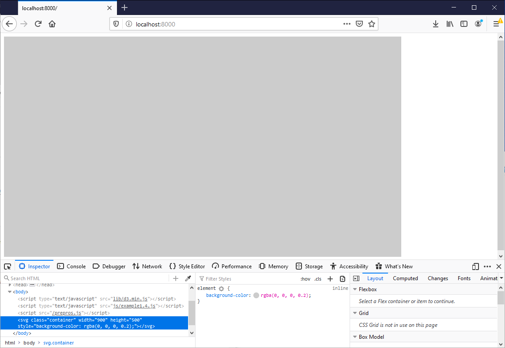
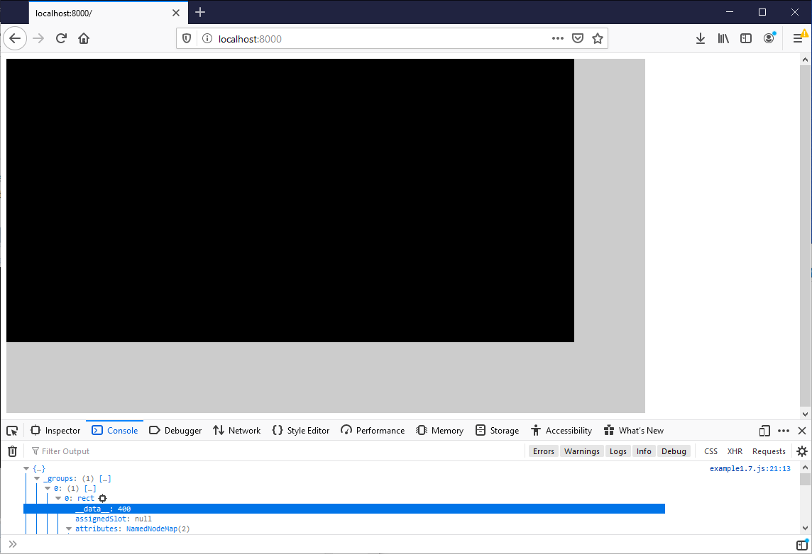
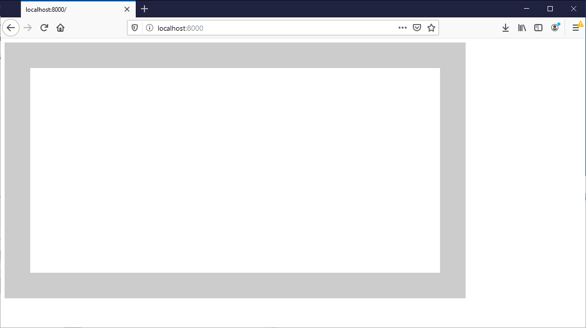
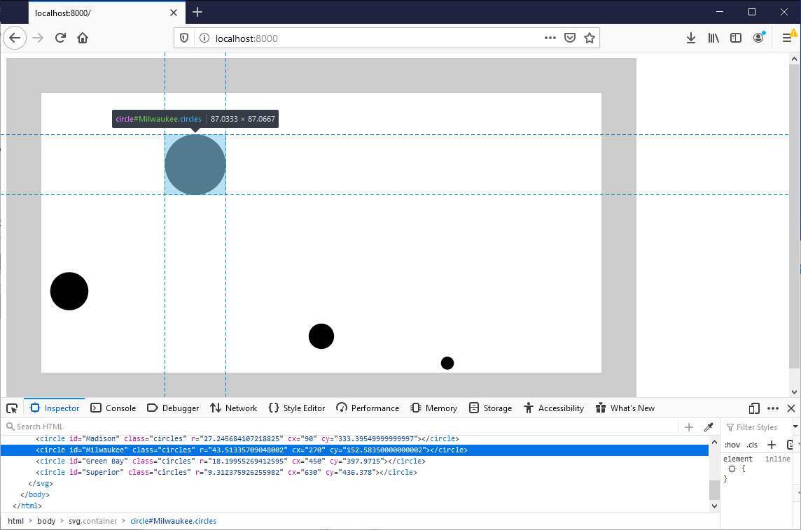
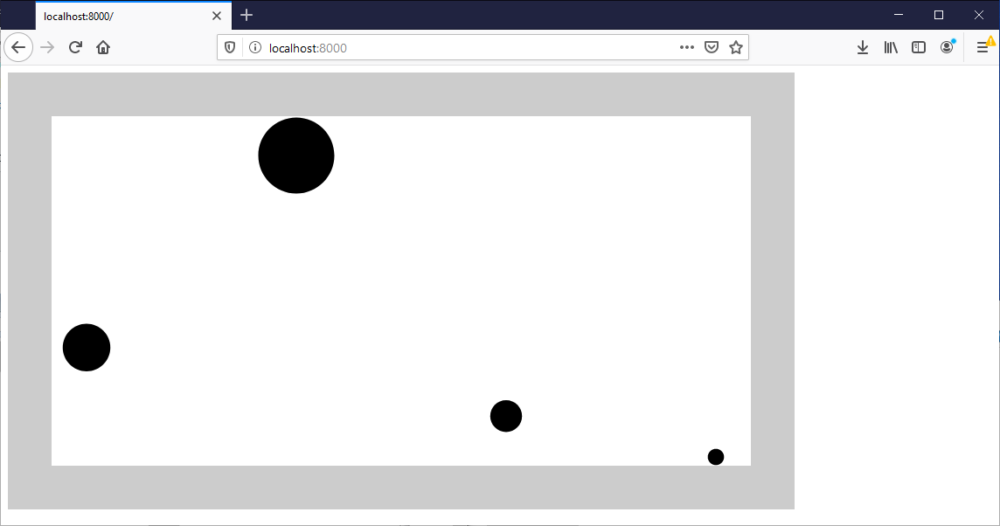
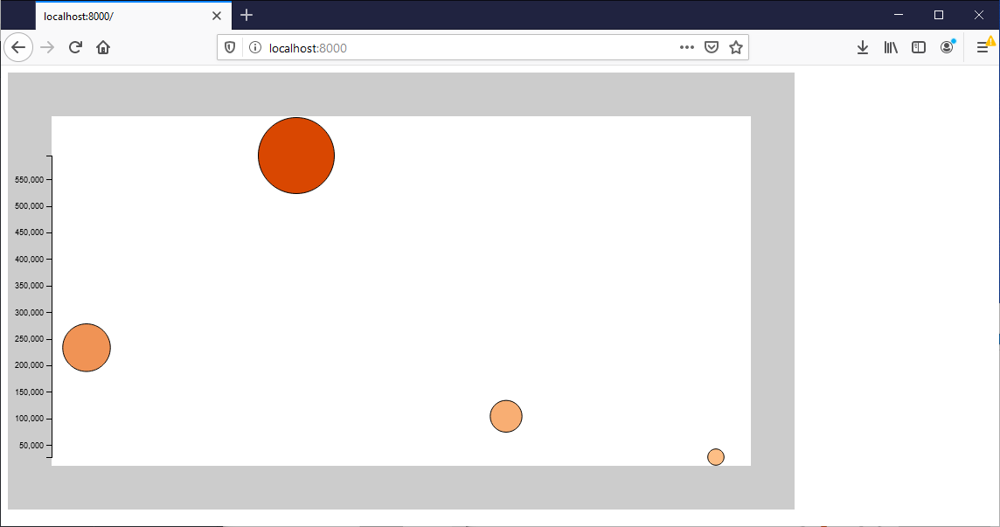
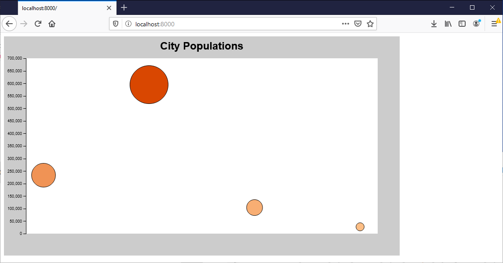
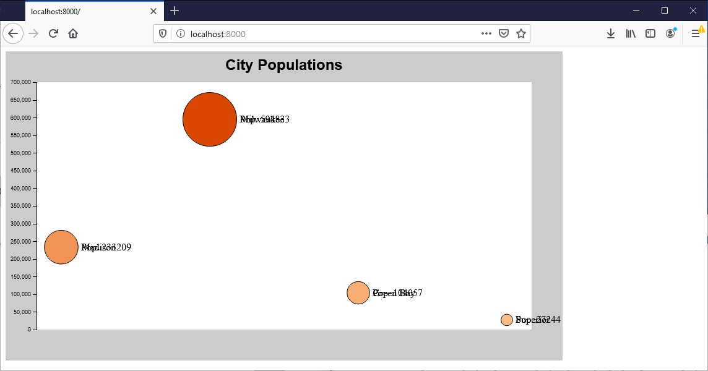
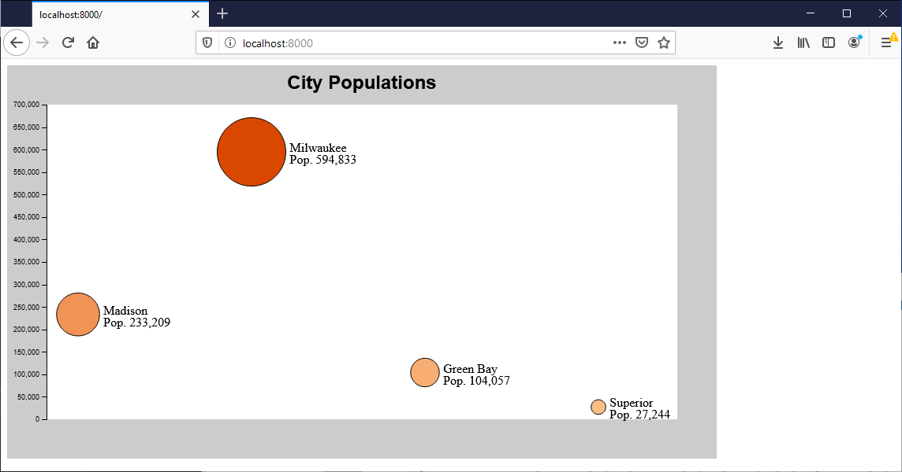

### [Return Home](../../../) | [Previous Chapter](../Chapter07) | [Next Chapter](../Chapter09)

Chapter 8: D3 Foundations
========================

Welcome to the first of four chapters in Unit 3 on D3, a powerful JavaScript library supporting coordination across many different kinds of map and visualization types. 

*   In Lesson 1, we investigate selections and blocks, the code structures that provide the backbone of D3 script.
*   In Lesson 2, we expand on D3 selections to make data joins that transform geospatial data into DOM elements.
*   In Lesson 3, we introduce the concept of generator functions for building data-driven graphics with D3, first using the scale generator to position SVG elements on a chart and then an axis generator to add annotation to the margins.

After this chapter, you should be able to:

*   Create a selection and use D3 code blocks to make a basic SVG image
*   Dynamically draw SVG elements using a data join
*   Use scales to position SVG elements on a chart and annotate the chart with axes and text

Lesson 1: D3 Selections and Blocks
----------------------------------

### I. Introduction to D3

[_**D3**_](http://d3js.org/) stands for _**D**ata-**D**riven **D**ocuments_, a JavaScript library for making data-driven web graphics. D3 is an open-source JavaScript library pioneered and maintained by Mike Bostock formerly of the New York Times ([http://bost.ocks.org/mike](http://bost.ocks.org/mike)). Increasingly recognized as a leading data visualization library, D3 simplifies loading and interacting with data and draws all graphics as client-side (in the browser) vectors using the SVG (Scalable Vector Graphics) standard.

D3 presents a different philosophy of web mapping than the majority of technologies that produce web maps: Leaflet and most other web mapping libraries produce _slippy maps_ based on sets of tiled raster images loaded dynamically into the browser when needed. A common complaint from cartographers about slippy maps is their reliance on cylindrical projections, specifically the conformal Web Mercator projection that heavily distorts sizes and thus is inappropriate for visualization at small cartographic scales (i.e., broad geographic regions, such as world maps). The D3 focus on SVG allows for dynamic map projection and direct feature interaction. 

You can review hundreds of fantastic example visualizations created by D3 developers in the [D3 Gallery](https://github.com/mbostock/d3/wiki/Gallery). Most of these examples include the code for their creation right on the page, making duplication and experimentation easier. A word of caution, however: it is tricky to interpret the example documentation before understanding some basics about D3. Likewise, the library's [API documentation](https://github.com/d3/d3/blob/master/API.md), while thorough, can be difficult to apply to your problems without some preliminary background knowledge on D3.

In this module, we introduce the core principles used by the library to build a simple data-driven graphic. Important formatting rules are highlighted by bullet points; use these to keep your code neater and facilitate the development and debugging process.

To begin, you will need to copy your [boilerplate](../Chapter04/boilerplate.zip) web directory and rename the copy _unit-3_. Then, download the library from the [D3 website](http://d3js.org/), unzip it, place it in the _lib_ folder of your new website, and add a script link to it in _index.html_. Create a _main.js_ file for the _unit-3_ web directory, save it to the _js_ folder, and add a second script link to it. Finally, create a _style.css_ file, save it to the _css_ folder, and link to it in _index.html_. Finally, create a _data_ folder that will hold your Unit 2 multivariate dataset.

> ### **Create a new web directory called _unit-3_. Add _d3.js_ to the _lib_ folder, _main.js_ to the js folder, and _style.css_ to the _css_ folder. Add links for each file in the appropriate places in _index.html_. Also add a _data_ folder, which will house your Unit 3 multivariate dataset. Create a new Git repository for the directory and sync it with GitHub.**

### II. Selections

The core of D3 is the _**selection**_, allowing its methods to interface with the DOM much like selections in jQuery. Recall that a selector is a string parameter that uses the same syntax as CSS to select an element in the DOM, e.g., `"tagname"`, `".classname"`, `"#id"`, etc.

There are two methods used to create a selection: [`d3.select()`](https://github.com/d3/d3-selection/blob/master/README.md#select) and [`d3.selectAll()`](https://github.com/d3/d3-selection/blob/master/README.md#selectAll), which differ by how many markup elements are selected at once. The `d3.select()` method selects only the _first_ element in the DOM that matches the selector. Subsequent methods chained to the selection only affect that element. Conversely, `d3.selectAll()` grabs _all_ markup elements in the DOM that match the selector and applies any subsequent methods to all of the selected elements.

We will demonstrate the utility of this distinction over the course of the Chapter 8 and 9 lessons. For now, let's start our script by using `d3.select()` to select the HTML `<body>` and D3's `.append()` method to add a new `<svg>` element, which eventually will hold our data-driven graphic. Make the selection in your _main.js_ file (Example 1.1).

###### Example 1.1:  Selecting the `<body>` in _main.js_

    //execute script when window is loaded
    window.onload = function(){
    
        var container = d3.select("body") //get the <body> element from the DOM
    
    };
    

This selects the HTML `<body>` element from the DOM and returns it to the variable `container`. Notice that there is <ins>_no_</ins> semicolon after the `.select()` method. This is intentional, as we will be chaining more methods to it momentarily. D3 utilizes method chaining in a way that's similar to jQuery, but to an even greater extent.

At this stage, if you were to issue the statement `console.log(container)`, you would see a nested array with the `body` as the only element (Figure 1.1).

###### Figure 1.1: The D3 `body` selection

Having first created the `<body>` selection, you can alter the selection by applying operators to it. In the context of D3, _**operators**_ are methods that work on selections and typically are chained together to reduce the code. Thus, for D3, operators describe actions that can be both system-driven (e.g., loading, processing, and rendering data) as well as user-driven (e.g., [interaction "operators" as used in UX design](https://gistbok.ucgis.org/bok-topics/user-interface-and-user-experience-uiux-design)). However, the formatting convention for D3 places each operator on its own line, indented one tab width from the initial line of the method chain. Because this tends to result in code that appears squarish or rectangular, a multi-line chain of D3 operators is referred to as a _**code block**_ or just **_block_**.

*   **_Rule:_** _Place each operator applied to a selection on its own line, indented one tab from the first line of the code block._

Use D3's `.append()` operator to add the `<svg>` container, creating our first block (Example 1.2).

###### Example 1.2: Appending the `<svg>` to the `<body>` in _main.js_

        //Example 1.1 line 3...container block
        var container = d3.select("body") //get the <body> element from the DOM
            .append("svg") //put a new svg in the body

Reload your _unit-3_ website and use the inspector to see the new SVG in the DOM (Figure 1.2).

###### Figure 1.2: An SVG created using D3

Note that both jQuery and D3 have `.append()` methods. In this case, we know that the `.append()` method we are using belongs to D3 because the block starts with `d3`. Recall from Chapter 6 how JavaScript object prototypes work: D3's `.append()` is a method of the `d3` object, just as jQuery's `.append()` is a method of the `jQuery` object (and its `$` alias). In any script that uses chain syntax or blocks (such as D3, Leaflet, and jQuery), the methods you can use in the chain depend on the library object referenced at the beginning of the chain (e.g., `d3`, `L`, or `$`). You can identify which library is being used by reading backwards up the chain or block to its beginning. If the beginning of the chain or block is a variable, you need to look at how that variable was created to discover which library is being used.

*   **_Rule:_** _In any method chain or block, only chain together methods belonging to the library referenced at the start of the chain._

### III. Operands

In Example 1.1, the block chain is assigned to an `<svg>` variable called `container`. In other words, this variable stores the data-driven _**operand**_ receiving the D3 operators, much like [the use of "operand" in UX design](https://gistbok.ucgis.org/bok-topics/user-interface-and-user-experience-uiux-design). To make the purpose of each block clear, assign each block to a variable based on the operand that is returned when the end of the block is reached. The operand variable serves as the _**block name**_. Remember that it is important to place a semicolon _only_ at the _end_ of a block, and not on each line, as a semicolon tells the browser that it has reached the end of a statement, breaking your method chain to conclude a block.

*   **_Rule:_** _Only place a semicolon after the last line of a block. If your code results in errors, look for a wayward semicolon._
    
*   **_Rule:_** _Give each block a name by assigning it to a variable named for the operand it holds._
    

Now that the `<svg>` element is our operand, we can add operators to the block that manipulate that element. Recall from Chapter 6 that every SVG requires `width` and `height` attributes. These values can be stored in separate variables that are passed as parameters to the operators. We can use D3's [`.attr()`](https://github.com/d3/d3-selection/blob/master/README.md#selection_attr) operator to assign any attributes to markup elements (Example 1.3).

###### Example 1.3: Adding attributes to the `<svg>` element in _main.js_

        //SVG dimension variables
        var w = 900, h = 500;
    
         //Example 1.2 line 1...container block
        var container = d3.select("body") //get the <body> element from the DOM
            .append("svg") //put a new svg in the body
            .attr("width", w) //assign the width
            .attr("height", h) //assign the height
            .attr("class", "container") //always assign a class (as the block name) for styling and future selection
    

You also can use the [d3-selection-multi module](https://github.com/d3/d3-selection-multi), which provides a more concise syntax for setting multiple attributes.

In addition to setting the dimensions of an `<svg>` element, it is good practice to add a class name to each newly created element in the block so that it can be easily selected and manipulated by CSS or future D3 script (Example 1.3 line 9). Making the element's class name identical to the block name avoids confusion later in the script.

*   **_Rule:_** _Assign each newly created element a class name identical to the name of the block._

Before closing the block, add an inline style to the `<svg>` element, coloring the background so we can see the container on the page. Note that you also can do this in a CSS stylesheet by applying the style to the `container` class. To add a higher-priority inline style, we can use D3's [`.style()`](https://github.com/d3/d3-selection/blob/master/README.md#selection_style) operator the same way we would use jQuery's `.css()` method. Upon styling, add a semicolon to close the block (Example 1.4).

###### Example 1.4: Adding an inline style to the container in _main.js_

        //Example 1.3 line 4...container block
        var container = d3.select("body") //get the <body> element from the DOM
            .append("svg") //put a new svg in the body
            .attr("width", w) //assign the width
            .attr("height", h) //assign the height
            .attr("class", "container") //assign a class name
            .style("background-color", "rgba(0,0,0,0.2)"); //only put a semicolon at the end of the block!
    

You now can see the SVG container on the page as well as using the Inspector (Figure 1.3).

###### Figure 1.3: The SVG container on the page and in the DOM

Once you have added the SVG `container` element, try drawing additional SVG graphics within it. For example, to add an inner rectangle to frame our graphics, you might try adding to the `container` block by appending a new rectangle and adding operators to style it (Example 1.5).

###### Example 1.5: A block with too many operands in _main.js_

        //Example 1.4 line 1...container block
        var container = d3.select("body") //get the <body> element from the DOM
            .append("svg") //put a new svg in the body
            .attr("width", w) //assign the width
            .attr("height", h) //assign the height
            .attr("class", "container") //assign a class name
            .style("background-color", "rgba(0,0,0,0.2)") //svg background color
            .append("rect") //add a <rect> element
            .attr("width", 800) //rectangle width
            .attr("height", 400) //rectangle height
    
        // <rect> is now the operand of the container block
    

The problem with Example 1.5 is that appending the `<rect>` element changes the operand from `<svg>` to `<rect>`. Thus, what's now returned to the `container` variable is the `<rect>` element, not the `<svg>`. This means that _only_ the `<rect>` element can be added to the `<svg>`; there is no longer a way to append other elements to the container unless you create a completely new selection. While this is possible to do, it is much more convenient to "save" the existing `<svg>` selection in the `container` variable for multiple uses. This simply involves breaking the block and creating a second block for the inner rectangle (Example 1.6).

###### Example 1.6: Correctly formatted blocks with only one change of operand each in _main.js_

        //Example 1.5 line 1...container block
        var container = d3.select("body") //get the <body> element from the DOM
            .append("svg") //put a new svg in the body
            .attr("width", w) //assign the width
            .attr("height", h) //assign the height
            .attr("class", "container") //assign a class name
            .style("background-color", "rgba(0,0,0,0.2)"); //svg background color
    
        //innerRect block
        var innerRect = container.append("rect") //put a new rect in the svg
            .attr("width", 800) //rectangle width
            .attr("height", 400) //rectangle height
    

Notice that the new `innerRect` block starts by accessing the `container` variable—which holds the `<svg>` as its operand—and appending the `<rect>` element to it. The `container` variable preserves its operand while the `<rect>` element becomes the operand of `innerRect`.

We can expand this principle into another general rule of thumb:

*   **_Rule:_** _Create only one new element per block._

In Example 1.7, the `container` block creates our `<svg>` and the `innerRect` block creates our `<rect>`. If we want to append something else new to either element, start a new block and name it for the new element we want to append.

### IV. Datum

So far, D3 selections and blocks may seem pretty straightforward—again, very similar to a version of jQuery with extended method chaining syntax. However, where D3 departs from this model is a special property of its selections: the _**datum**_.

In a selection created with `d3.select()` (or their children, such as `innerRect`), the [`.datum()`](https://github.com/d3/d3-selection/blob/master/README.md#selection_datum) operator is used to _**bind**_ a data value to the selection. The `.datum()` method takes a _single data value_ (literally, a [datum](http://dictionary.reference.com/browse/datum)) as a parameter and attaches it to the selection (Example 1.7).

###### Example 1.7: Binding a datum to the `innerRect` selection in _main.js_

        //Example 1.6 line 9...innerRect block
        var innerRect = container.append("rect") //put a new rect in the svg
            .datum(400)
            .attr("width", 800) //rectangle width
            .attr("height", 400) //rectangle height
    
        console.log(innerRect);
    

If you examine the inner array of the `innerRect` selection in the console, you will see that there is a property called *`data`* attached to the `<rect>` element in the DOM. This property holds the datum. Figure 1.4 shows our new rectangle with a default black fill and the datum that is bound to it in the DOM.

###### Figure 1.4: A rectangle and its datum

Now comes the fun part: actually _using_ the datum. Any D3 operator method that requires a value as one of its parameters can make use of a datum or data that is bound to the block. This is done through an anonymous function that returns the datum (Example 1.8).

###### Example 1.8: Using a datum in _main.js_

        //Example 1.7 line 1...innerRect block
        var innerRect = container.append("rect") //put a new rect in the svg
            .datum(400) //a single value is a datum
            .attr("width", function(d){ //rectangle width
                return d * 2; //400 * 2 = 800
            }) 
            .attr("height", function(d){ //rectangle height
                return d; //400
            })
    

On line 3 of Example 1.8, we bind the datum `400` to the `innerRect` block using `.datum(400)`. That makes `400` available as the parameter of any anonymous function used by an operator in the block. On lines 4 and 7, we name this parameter `d`. We also could name it `cheese` or `gobadgers`; either way it would contain the value `400`. Returning `d` in each function, or some derivative (e.g., `d * 2`), sends that value to the operator. Since the returned values in Example 1.9 match the hard-coded values in Example 1.8, you should not observe any visible changes to the rectangle in your browser yet.

To complete our rectangle, we will assign a few more [`<rect>`](https://developer.mozilla.org/en-US/docs/Web/SVG/Element/rect) attributes to give the element a class name, position it, and style it differently from the default black fill (Example 1.9).

###### Example 1.9: Adding rectangle attributes and style in _main.js_

        //Example 1.8 line 1...innerRect block
        var innerRect = container.append("rect")
            .datum(400) //a single value is a DATUM
            .attr("width", function(d){ //rectangle width
                return d * 2; //400 * 2 = 800
            })
            .attr("height", function(d){ //rectangle height
                return d; //400
            })
            .attr("class", "innerRect") //class name
            .attr("x", 50) //position from left on the x (horizontal) axis
            .attr("y", 50) //position from top on the y (vertical) axis
            .style("fill", "#FFFFFF"); //fill color
    

Reload your browser window to view the white rectangle centered inside the SVG (Figure 1.5).

###### Figure 1.5: The finished inner rectangle

> ### **Create a visible SVG graphic with an inner rectangle using properly formatted D3 code blocks in the _main.js_ script of your _unit-3_ site.**

Lesson 2: Data
--------------

### I. Data-Driven Graphics

D3 starts with data. Lesson 1 demonstrated how the library can use a single data value—a datum—to draw and manipulate graphics. This is just the tip of the iceberg. In Lesson 2, we dive into the much more powerful capabilities of D3 to make use of **_data_**, plural—any number of data values strung together in a JavaScript array.

Beyond a single datum, D3 requires multiple data items to be formatted as an array. <ins>**_You cannot feed an object to a D3 selection_**</ins>. However, D3 can utilize any _type_ of data as long as it is formatted as an array. Consider, for instance, the following arrays (Example 2.1).

###### Example 2.1: Various types of JavaScript arrays

    var numbersArray = [1, 2, 3];
    
    var stringsArray = ["one", "two", "three"];
    
    var colorsArray = ["#F00", "#0F0", "#00F"];
    
    var objectsArray = [
        { 
            city: 'Madison',
            population: 233209
        },
        {
            city: 'Milwaukee',
            population: 594833
        },
        {
            city: 'Green Bay',
            population: 104057
        }
    ];
    
    var arraysArray = [
        ['Madison', 23209],
        ['Milwaukee', 593833],
        ['Green Bay', 104057]
    ];
    

*   **_Rule:_** _All data passed to the `.data()` operator must be formatted as an array._

Let's think about how this might relate to mapping for a moment. In the Leaflet map, you used geographic data in GeoJSON format to place proportional symbols on your map. A GeoJSON starts with an outer object, not an array. But what's the main thing _inside_ the GeoJSON object? A `"features"` array (Example 2.2 line 3).

###### Example 2.2: The start and end of _MegaCities.geojson_

    {
        "type":"FeatureCollection",
        "features":[
            {
                "type":"Feature",
                "properties":{
                    "City":"Tokyo",
                    ...
        ]
    }
    

In Chapter 9, we will find that D3 allows us to map GeoJSON geometries by making use of the `"features"` array. For now, let's return to the basics.

### II. Joining Data

In Lesson 1, we looked at how to bind a single datum to a selection for styling a markup element. But what if you want to create a _set_ of new elements and style them in a way that corresponds to a bunch of different data values? Say we want to create a bubble chart, with several circles styled according to a dataset. D3 supports manipulation and rendering of multiple data elements through a  _[**join**](http://bost.ocks.org/mike/join/)_, as a result "joining" an array of data to an array of markup elements in the DOM.

The first thing we need to create a join is a data array, such as those presented in Example 2.1. Add a simple array of numbers to the existing script from Lesson 1 (Example 2.3).

###### Example 2.3: A data array in _main.js_

        //below Example 1.9
        var dataArray = [10, 20, 30, 40, 50];
    

Now we need to start a new block that will create our circles. Since we are creating these circles after the inner rectangle, they will appear on top of the rectangle on the browser page. To create multiple, different circles at once, we cannot use the `d3.select()` method we used for the rectangle, as this type of selection can only make use of a single datum. Instead, to begin the block, we use an important trio of methods supporting a join: `d3.selectAll()`, `.data()`, and `.enter()` (Example 2.4).

###### Example 2.4: An important trio of operators in _main.js_

        //Example 2.3 line 1
        var dataArray = [10, 20, 30, 40, 50];
    
        var circles = container.selectAll(".circles") //but wait--there are no circles yet!
            .data(dataArray) //here we feed in an array
            .enter() //one of the great mysteries of the universe
    

Recall from Lesson 1 that `d3.selectAll()` selects all matching elements in the DOM. However, in the case above (Example 2.4 line 4), there are not yet any existing elements with the class name `"circles"` in the DOM. Feeding a parameter that does not return anything to `d3.selectAll()` creates an _**empty selection**_. The parameter `".circles"` is merely a placeholder; in fact, any string that does not match existing element IDs works here, although it is convention to use the class name of the _future_ elements you will create. If you were to feed it a selector referencing already-existing elements, `d3.selectAll()` would create a selection out of all of the elements matching the selector. But since we want to create new elements based on our data array, we need to create an empty selection by using a selector with no match.

*   **_Rule:_** _Always pass the block's name as a class selector to the `.selectAll()` method when creating an empty selection._

The next step is to feed in our data array as the parameter of the `.data()` operator (Example 2.5 line 5). The third method, `.enter()` (line 6), takes no parameters and joins the data to the selection, creating an array of placeholders for one markup element per data value in the array. The rest of the block then functions like a loop through the data array: each operator is applied once for each value in the data array. We first can make use of this to create a circle for every array value (Example 2.5).

###### Example 2.5: Adding circles to match the data in _main.js_

        //Example 2.4 line 1
        var dataArray = [10, 20, 30, 40, 50];
    
        var circles = container.selectAll(".circles") //but wait--there are no circles yet!
            .data(dataArray) //here we feed in an array
            .enter() //one of the great mysteries of the universe
            .append("circle") //add a circle for each datum
            .attr("class", "circles") //apply a class name to all circles
    

If we now view the markup using the developer tools HTML tab, we can see our newly-created `<circle>` elements (Figure 2.1).

###### Figure 2.1: The circles exist!

Notice there are five circles, one for each datum. Using `.append()` after a data join always creates the same number of new HTML elements as data values in the dataset. The `svg` circles are not visible on the page because, as you may recall from Chapter 6, they require `r`, `cx`, and `cy` attributes. We can use our joined data to position the circles (Example 2.6).

###### Example 2.6: Using the joined data in _main.js_

        //Example 2.5 line 1
        var dataArray = [10, 20, 30, 40, 50];
    
        var circles = container.selectAll(".circles") //but wait--there are no circles yet!
            .data(dataArray) //here we feed in an array
            .enter() //one of the great mysteries of the universe
            .append("circle") //add a circle for each datum
            .attr("class", "circles") //apply a class name to all circles
            .attr("r", function(d, i){ //circle radius
                console.log("d:", d, "i:", i); //let's take a look at d and i
                return d;
            })
            .attr("cx", function(d, i){ //x coordinate
                return 70 + (i * 180);
            })
            .attr("cy", function(d){ //y coordinate
                return 450 - (d * 5);
            });
    

In a block with a data join, the anonymous functions that return a second parameter to operators (such as on lines 9, 13, and 16 of Example 2.6) can make use of each datum (`d` in the example) as well as the index of the datum in the data array (`i`). The `console.log()` statement on line 10 prints each parameter to the console to make them easier to understand. Again, picture the entire block after `.enter()` as a loop—one in which you have immediate access to each array value and the array index within every anonymous function fed to an operator. In Example 2.6, we use each datum to set the radius and center y (vertical) coordinate of the circle, and the index to set the center x (horizontal) coordinate. Figure 2.2 shows the result along with the data and index values in the Firebug Console.

###### Figure 2.2: Data-driven circles

### III. Complex Data

So far, we have relied upon a very simple array to build our example graphic. What if we want something a little more complex and meaningful—say, a graph of city populations. We can start with our more complicated data array from way back in Chapter 2 (Example 2.7).

###### Example 2.7: The city populations data array from Chapter 2

    var cityPop = [
        { 
            city: 'Madison',
            population: 233209
        },
        {
            city: 'Milwaukee',
            population: 594833
        },
        {
            city: 'Green Bay',
            population: 104057
        },
        {
            city: 'Superior',
            population: 27244
        }
    ];
    

We can make a bubble chart out of this data by combining it with our `circles` block. We need to make a few modifications to the block: derive the circle radius from the populations as areas and derive the center y coordinates from the populations times a scale factor (Example 2.8). Let's pass on Flannery for now for demonstrative purposes.

###### Example 2.8: Using the `cityPop` array to create circles in _main.js_

        var cityPop = [
            { 
                city: 'Madison',
                population: 233209
            },
            {
                city: 'Milwaukee',
                population: 594833
            },
            {
                city: 'Green Bay',
                population: 104057
            },
            {
                city: 'Superior',
                population: 27244
            }
        ];
    
        //Example 2.6 line 3
        var circles = container.selectAll(".circles") //create an empty selection
            .data(cityPop) //here we feed in an array
            .enter() //one of the great mysteries of the universe
            .append("circle") //inspect the HTML--holy crap, there's some circles there
            .attr("class", "circles")
            .attr("id", function(d){
                return d.city;
            })
            .attr("r", function(d){
                //calculate the radius based on population value as circle area
                var area = d.population * 0.01;
                return Math.sqrt(area/Math.PI);
            })
            .attr("cx", function(d, i){
                //use the index to place each circle horizontally
                return 90 + (i * 180);
            })
            .attr("cy", function(d){
                //subtract value from 450 to "grow" circles up from the bottom instead of down from the top of the SVG
                return 450 - (d.population * 0.0005);
            });
    

Note that in Example 2.8, `d` still holds each of our array values, only now each value is an object with two properties (`city` and `population`). Thus, on on line 27, we use `d.city` to assign each city name as the circle `id`, and on lines 31 and 40, we use `d.population` to access the `population` value of each object. Figure 2.3 shows our city circles on the page and in the HTML.

###### Figure 2.3: A bubble chart of city populations

> ### **Using properly formatted D3 code blocks, create a bubble chart of the Chapter 2 example city data with circles named according to city name and sized according to city population.**

Lesson 3: Scales, Axes, and Text
--------------------------------

### I. Number Scales

So far, we have seen how D3 uses data to dynamically draw and style markup elements. But what if you want to manipulate the _data_ itself? Sometimes it is necessary to derive output values _as a function of_ your input data—or, put another way, to map a set of input values to a different set of output values. For these scenarios, D3 provides _[**scales**](https://github.com/d3/d3/blob/master/API.md#scales-d3-scale)_. There are five types of scales in D3: continuous, sequential, quantize, threshold, and ordinal. The first four types of scales have a continuous input _**domain**_, or set of values of the independent variable (x) of the scale function.

*   [**_Continuous scales_**](https://github.com/d3/d3-scale/blob/master/README.md#continuous-scales) map the domain to a continuous _**range**_ of output (y) values; these are useful for linear, power, and log scales (see below), axes, and [time scales](https://github.com/d3/d3-scale/blob/master/README.md#time-scales).
*   [_**Sequential scales**_](https://github.com/d3/d3-scale/blob/master/README.md#sequential-scales) are similar, but map the domain to an interpolator, or specific range function. These are most useful for creating color ramps.
*   [_**Quantize scales**_](https://github.com/d3/d3-scale/blob/master/README.md#sequential-scales) have a discrete range, or set of specific output values; we'll use those to create classed choropleths in Chapter 9.
*   [_**Threshold scales**_](https://github.com/d3/d3-scale/blob/master/README.md#threshold-scales) subdivide the continuous domain according to specified class breaks and map the subsets to discrete range values.
*   [_**Ordinal scales**_](https://github.com/d3/d3-scale/blob/master/README.md#ordinal-scales) have a discrete domain, such as names or categories, and a discrete range.

For now, we will focus on continuous scales. D3 offers several kinds of continuous scales, including linear scales, power scales, log scales, and others. You can explore these on the API documentation page linked above. The most used type of continuous scale is the _**[linear scale](https://github.com/d3/d3-scale/blob/master/README.md#linear-scales)**_, which simply interpolates values using linear algebra. It is important to note that there is nothing inherently _visual_ about a scale; it is merely a mathematical function used to derive a new data value from an input data value (Figure 3.1).

###### Figure 3.1: An example linear scale function with an input domain of \[0, 700000\] and output range of \[50, 450\]

How would we apply a scale? Let's say we wanted to space our circles more evenly along the horizontal axis of the bubble chart. As our script stands, we are using a simple mathematical equation with the array index value as an input domain to return each circle's center x position (Example 2.8 line 36). Instead, we can create a linear scale with an array of the minimum and maximum index values as the domain and an array with our desired minimum and maximum x coordinates as the range. Note that we must create our scale _above_ the `circles` block and assign it to a variable to use it in the block (Example 3.1).

###### Example 3.1: The x coordinate linear scale in _main.js_

        //above Example 2.8 line 20
        var x = d3.scaleLinear() //create the scale
            .range([90, 810]) //output min and max
            .domain([0, 3]); //input min and max
    

The operand of `x` is not a single value, object, or array. Instead, `d3.scaleLinear()` method creates what is called a _**generator**_. This is a _custom function_ that will be used to decide where in the range each output value lies based on each input datum sent to it. We can see this function if we add the statement `console.log(x)` below the block (Figure 3.2).

###### Figure 3.2: Scale generator created by `d3.scaleLinear()`

When passed a value, the scale generator will determine where that value lies in the scale's domain, and interpolate between the minimum and maximum range values to generate an output value proportional to the input. The way we apply our scale, then, is by calling its variable (`x`) like a function and passing in each datum as a parameter (Example 3.2).

###### Example 3.2: Applying the x scale to return the circles' center x coordinates in _main.js_

            //Example 2.8 line 34
            .attr("cx", function(d, i){
                //use the scale generator with the index to place each circle horizontally
                return x(i);
            })
    

We can do the same sort of thing with the center y coordinate of the circles. The difference here is that we have written our equation for `cy` to return a value based on each city's population. Therefore, to create a scale for `cy`, we need to determine the minimum and maximum populations of our dataset for our input domain. While you could write a complicated custom function to pull out these values, a much simpler way to do it is to make use of D3's [`.min()`](https://github.com/d3/d3-array/blob/master/README.md#min) and [`.max()`](https://github.com/d3/d3-array/blob/master/README.md#max) methods. These methods take up to two parameters: the array first, and then an accessor function that tells each method where to look for the values to compare. Once we have found these values and stored them in variables, we can apply them to the domain of our `y` scale (Example 3.3).

###### Example 3.3: Determining maximum and minimum population values in _main.js_

        //above Example 2.8 line 20
        //find the minimum value of the array
        var minPop = d3.min(cityPop, function(d){
            return d.population;
        });
    
        //find the maximum value of the array
        var maxPop = d3.max(cityPop, function(d){
            return d.population;
        });
    
        //scale for circles center y coordinate
        var y = d3.scaleLinear()
            .range([440, 95])
            .domain([
                minPop,
                maxPop
            ]);
    

Note that the range is flipped, with a "minimum" value of `440` and a "maximum" of `95`. Like the subtraction in our prior equation, this ensures that higher values are associated with "up" rather than "down", since the \[0,0\] coordinate of the SVG is its upper-left corner. We've chosen these values because they spread our circles most evenly over the inner rectangle of the chart without overflowing it. We now can apply our scale to our population values in the `cy` anonymous function (Example 3.4).

###### Example 3.4: Applying the y scale to return the circles' center y coordinates in _main.js_

            //Example 2.8 line 38
            .attr("cy", function(d){
                return y(d.population);
            });
    

Here are our much more evenly-spaced circles (Figure 3.3).

###### Figure 3.3: The bubble chart with scales applied

### II. Color Scales

One nice feature of D3 scales is that they support interpolation for just about any kind of value that can be interpolated—including color. For your D3 map, you will be creating a choropleth map, which will require the use of a color scale. Try an easy one for the circles on our bubble chart, with color value corresponding to population size. We will again make use of `d3.scaleLinear()` with the same domain as the `y` scale, but this time the range will be colors (Example 3.5).

###### Example 3.5: Implementing a color scale in _main.js_

        //above Example 2.8 line 20
        //color scale generator 
        var color = d3.scaleLinear()
            .range([
                "#FDBE85",
                "#D94701"
            ])
            .domain([
                minPop, 
                maxPop
            ]);
    
        ...
    
            //Example 3.4 line 1
            .attr("cy", function(d){
                return y(d.population);
            })
            .style("fill", function(d, i){ //add a fill based on the color scale generator
                return color(d.population);
            })
            .style("stroke", "#000"); //black circle stroke
    

Since our color scale generator uses only two color values for the range (lines 4-7), the result will be an unclassed color scheme, with each color derived from interpolation between the two range colors. For a classed color scheme (such as you will use in the D3 map), you simply need to provide an array with each of the colors used for the classes as the range.

Here is the output of our simple unclassed color scale (Figure 3.4).

###### Figure 3.4: Colored circles

> ### **Create and apply D3 scale generators for the center x coordinate, center y coordinate, and fill color of your circles.**

### III. Axes

With four colored, proportionally-sized and -positioned circles, our bubble chart is looking pretty good—except that nobody looking at it would know how to read it! In order to make a data graphic useful, you need to give users _**affordances**_ to contextualize the information they are seeing. One important affordance is an _**axis**_, the familiar reference line with tick marks and numbers that makes the graphic's scale in any one dimension visible to the user. D3 includes a module for automatically drawing axes, although it can be a bit of a trick to apply properly.

For our bubble chart, the horizontal scale is basically meaningless; it uses the data array index values as inputs and only functions to separate our circles evenly. Our vertical scale, on the other hand, makes meaningful use of our population data. Thus, it makes sense to provide the user with a vertical axis as a visual affordance for the information encoded by each circle's `"cy"` attribute. We create a vertical access on the left side of the chart based on our vertical scale using `d3.axisLeft(y)` (Example 3.6).

###### Example 3.6: Creating the y axis generator in _main.js_

        //below Example 3.5...create y axis generator
        var yAxis = d3.axisLeft(y);
    

Just as a scale starts with creating a scale generator function, `d3.axisLeft(y)` creates an axis generator function. The argument, `y`, is our scale generator; the axis generator references this function to do its work.

The next step is to create a new SVG element to hold the axis. The axis generator will automatically draw several new child elements, so the best thing to put them in is a `<g>` (group) element (Example 3.7).

###### Example 3.7: Adding the y axis in _main.js_

        //Example 3.6 line 1...create y axis generator
        var yAxis = d3.axisLeft(y);
    
        //create axis g element and add axis
        var axis = container.append("g")
            .attr("class", "axis")
            .call(yAxis);
    

Note that we use the `.call()` method to invert the order of the code, feeding the `axis` selection to the `yAxis`. This is a useful shorthand for generator that does not return anything (Example 3.8).

###### Example 3.8: Inverting `.call(yAxis)` in _main.js_

        //Example 3.7 line 6...create axis g element and add axis
        var axis = container.append("g")
            .attr("class", "axis");
    
        yAxis(axis);
    

If you now refresh your browser, you will not see anything different unless you hunt for the axis in the developer tools HTML tab (Figure 3.5).

###### Figure 3.5: The hidden axis

Figure 3.5 shows that the axis in the DOM, but way off to the left, outside the bounds of our SVG container. This is because the left orientation of the axis aligns its rightmost side with the left edge of the element to which it is appended. In order to see it, we need to add a `"transform"` attribute to the `<g>` element that translates (moves) it to the right of its `0,0` coordinate (Example 3.9).

###### Example 3.9: Translating the axis 50 pixels right in _main.js_

        //Example 3.8 line 1...create axis g element and add axis
        var axis = container.append("g")
            .attr("class", "axis")
            .attr("transform", "translate(50, 0)")
            .call(yAxis);
    

Now we can see our axis, lined up properly with our inner rectangle, 50 pixels in from the left edge of the container (Figure 3.6).

###### Figure 3.6: The axis, revealed

We can see our axis, but it is difficult to read. We need to style it properly to make it neater. We could do this using `.style()` in our `axis` block, but since the styles we will add are not dynamically generated by the data, we may as well add them in _style.css_ (Example 3.10).

###### Example 3.10: Styling the axis in _style.css_

    .axis path,
    .axis line {
        fill: none;
        stroke: black;
        stroke-width: 1px;
        shape-rendering: crispEdges;
    }
    
    .axis text {
        font-family: sans-serif;
        font-size: 0.9em;
    }
    

*   **_Rule:_** _Assign static or default styles in \*style.css_.\*

In Example 3.10, we give all `<path>` and `<line>` elements within the axis `<g>` element styles that render crisp, thin, black lines without any fill (lines 1-7). The `.axis text` style applies to the numbers, which we make smaller so they fit in the gray border of the chart. Here is the result (Figure 3.7).

###### Figure 3.7: A properly-styled y axis

The only disconcerting thing about our axis is that it does not reach from the bottom of the chart to the top. Instead, it reaches from the minimum range value to the maximum range value of the `y` scale. The simple solution is to adjust our `y` scale parameters so that the domain extends to nice round numbers a bit beyond the min and max data values while the range uses the maximum and minimum y coordinates of the inner rectangle (Example 3.11).

###### Example 3.11: Adjusting the y scale to make the axis fill the inner rectangle

        //Example 3.3 line 12...scale for circles center y coordinate
        var y = d3.scaleLinear()
            .range([450, 50]) //was 440, 95
            .domain([0, 700000]); //was minPop, maxPop
    

Figure 3.8 shows the more desirable axis.

###### Figure 3.8: The revised axis

> ### **Create a vertical axis for your chart.**

### IV. Text

Our bubble chart is almost complete. It could use a title, though. Since SVG is mainly for drawing shapes, most SVG elements do not support text content. An exception is the `<text>` element. We can add a block to append one (Example 3.12).

###### Example 3.12: Adding a title to the chart

        //below Example 3.9...create a text element and add the title
        var title = container.append("text")
            .attr("class", "title")
            .attr("text-anchor", "middle")
            .attr("x", 450)
            .attr("y", 30)
            .text("City Populations");
    

In Example 3.12, the `"text-anchor"` attribute (line 4) center-justifies the text in the element, while the `x` and `y` attributes (lines 5 and 6) position the text anchor within the SVG container. The `.text()` operator (line 7) adds the text content. Now all we need to do is style our title a bit in _style.css_ (Example 3.13).

###### Example 3.13: Styling the title in _style.css_

    .title {
        font-family: sans-serif;
        font-size: 1.5em;
        font-weight: bold;
    }
    

We now have a nice title for our chart (Figure 3.9).

###### Figure 3.9: Chart title

A final useful touch is to label each circle with its corresponding city name and population. We can also use `<text>` elements for this purpose. We will need to join our `cityPop` data to the selection to correctly position each label (Example 3.14).

###### Example 3.14: Creating circle labels in _main.js_

        //below Example 3.12...create circle labels
        var labels = container.selectAll(".labels")
            .data(cityPop)
            .enter()
            .append("text")
            .attr("class", "labels")
            .attr("text-anchor", "left")
            .attr("x", function(d,i){
                //horizontal position to the right of each circle
                return x(i) + Math.sqrt(d.population * 0.01 / Math.PI) + 5;
            })
            .attr("y", function(d){
                //vertical position centered on each circle
                return y(d.population) + 5;
            })
            .text(function(d){
                return d.city + ", Pop. " + d.population;
            });
    

Figure 3.10 illustrates the result.

###### Figure 3.10: Circle labels

This works quite well, except that the labels are a bit long. Superior's even overflows the container. It would be nice if we could wrap these labels onto two lines. Note that if you search for how to do this online, you are likely to be directed towards [Mike Bostock's tutorial](http://bl.ocks.org/mbostock/7555321) that is quite complicated. It is much simpler to manually break lines using SVG `<tspan>` elements. These are child elements of a `<text>` element that can be independently positioned relative to their parent. We can create a separate `<tspan>` for each line of our label. Instead of setting our `"x"` attribute and text content in the `labels` block, we will instead move these to each of our separate `<tspan>` blocks to horizontally align them and give each one custom content (Example 3.15).

###### Example 3.15: creating `<tspan>` elements in _main.js_

        //Example 3.14 line 1...create circle labels
        var labels = container.selectAll(".labels")
            .data(cityPop)
            .enter()
            .append("text")
            .attr("class", "labels")
            .attr("text-anchor", "left")
            .attr("y", function(d){
                //vertical position centered on each circle
                return y(d.population) + 5;
            });
    
        //first line of label
        var nameLine = labels.append("tspan")
            .attr("class", "nameLine")
            .attr("x", function(d,i){
                //horizontal position to the right of each circle
                return x(i) + Math.sqrt(d.population * 0.01 / Math.PI) + 5;
            })
            .text(function(d){
                return d.city;
            });
    
        //second line of label
        var popLine = labels.append("tspan")
            .attr("class", "popLine")
            .attr("x", function(d,i){
                //horizontal position to the right of each circle
                return x(i) + Math.sqrt(d.population * 0.01 / Math.PI) + 5;
            })
            .text(function(d){
                return "Pop. " + d.population;
            });
    

Figure 3.11 shows the result.

###### Figure 3.11: Label mush

We now have separated the city name and population into two separate lines, but they are on top of each other! The solution is to offset the second line vertically from the first by adding a `"dy"` attribute to it (Example 3.16).

###### Example 3.16: Offsetting the second line in _main.js_

        //Example 3.15 line 24...second line of label
        var popLine = labels.append("tspan")
            .attr("class", "popLine")
            .attr("x", function(d,i){
                return x(i) + Math.sqrt(d.population * 0.01 / Math.PI) + 5;
            })
            .attr("dy", "15") //vertical offset
            .text(function(d){
                return "Pop. " + d.population;
            });
    

With this adjustment, both lines of each label should be visible (Figure 3.12).

###### Figure 3.12: Double-barrel labels

Now, if we are really finnicky, we can critique our population numbers for not being correctly formatted with commas (or periods in some countries) every three decimal places. Luckily, D3 provides a handy method, [`d3.format()`](https://github.com/d3/d3-format/blob/master/README.md#format), for formatting numbers as text. This method takes a format specifier string modeled on Python's [format specifications](https://docs.python.org/release/3.1.3/library/string.html#formatspec) as its parameter. Calling `d3.format()` with a format specifier returns a generator function, which can then be passed a value to format (Example 3.17).

###### Example 3.17: Formatting population numbers in _main.js_

        //create format generator
        var format = d3.format(",");
    
        //Example 3.16 line 1...second line of label
        var popLine = labels.append("tspan")
            .attr("class", "popLine")
            .attr("x", function(d,i){
                return x(i) + Math.sqrt(d.population * 0.01 / Math.PI) + 5;
            })
            .attr("dy", "15") //vertical offset
            .text(function(d){
                return "Pop. " + format(d.population); //use format generator to format numbers
            });
    

There are two other slight adjustments we will make to finish our chart:

*   adjust the `"y"` attribute in the `labels` block (Example 3.15 line 10) to vertically center the entire label with each circle;
    
*   adjust the maximum range value of our `x` scale (Example 3.1 line 3) to bring Superior's label entirely into the frame.
    

With these adjustments made, we have a complete, readable data graphic (Figure 3.13).

###### Figure 3.13: The finished bubble chart

> ### **Add a title and correctly formatted labels to your bubble chart.**

## Activity 8

1.  Create a _unit-3_ web directory.
2.  Create a bubble chart based on the dataset in the tutorial.
3.  Zip a copy of your _unit-3_ folder and upload it to Canvas. The folder should include the `index.html`, `main.js` in the `js`folder, `style.css` in the `css` folder and _D3_ library in your `lib` folder.
4. **Optional:** Commit the changes to your _unit-3_ directory and sync with GitHub. Include "Activity 8" in the commit message (Summary). 

_This work is licensed under a [Creative Commons Attribution 4.0 International License](http://creativecommons.org/licenses/by/4.0/).   For more information, please contact Robert E. Roth \(reroth@wisc.edu\)._

### [Return Home](../../../) | [Previous Chapter](../Chapter07) | [Next Chapter](../Chapter09)
