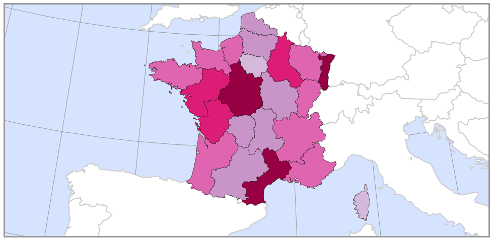
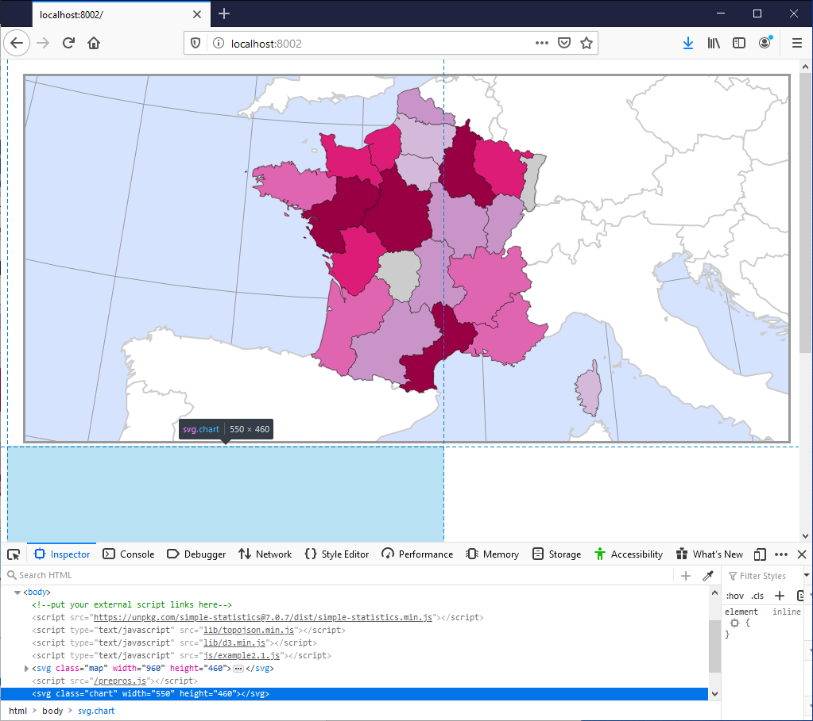
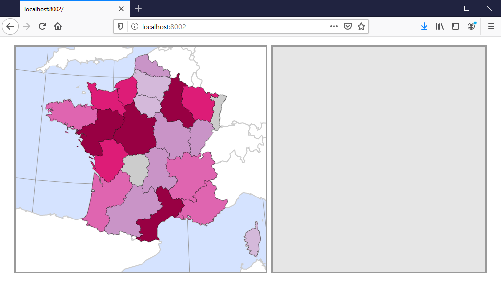
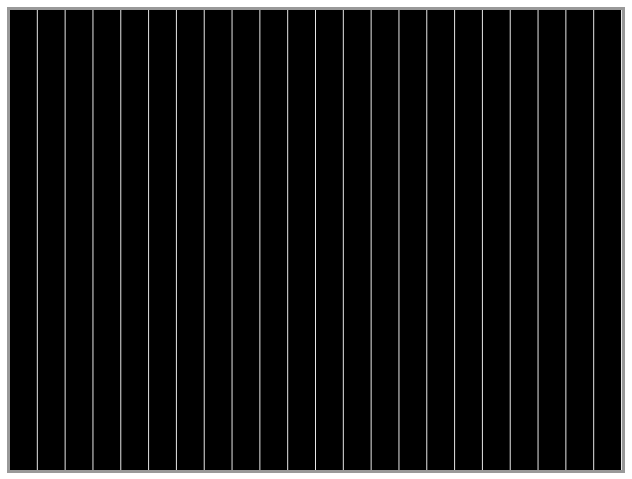
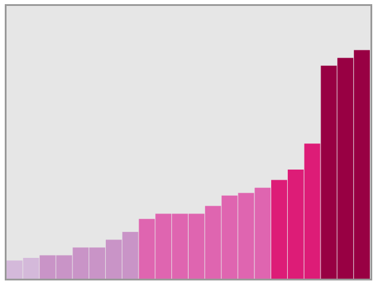
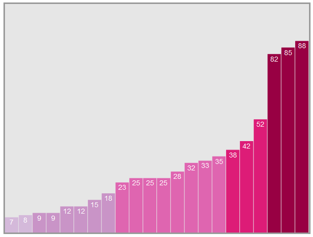
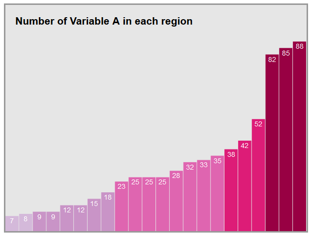
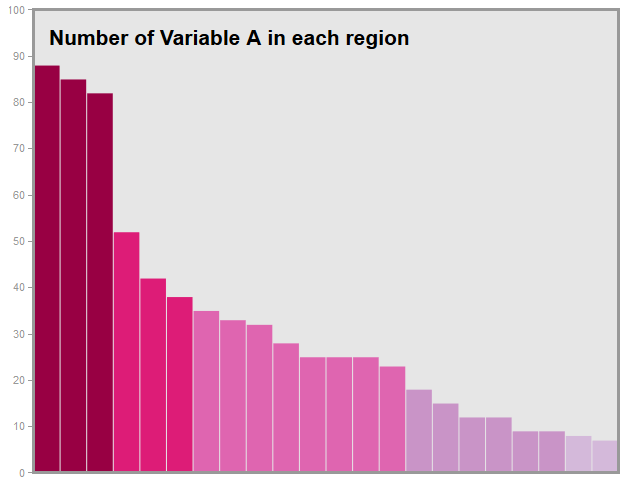

### [Return Home](../../../) | [Previous Chapter](../Chapter09) | [Next Chapter](../Chapter11)

Chapter 10: Coordinated Visualizations
=====================================

Congratulations on building your first basemap with D3! In Chapter 10, we will will apply what you have learned about D3 selections, scales, and geographic features for dynamically creating a coordinated, multiview visualization of the multivariate attribute dataset. Chapter 10 includes two long lessons and ends with Activity 10, a choropleth map with linked bar chart:

-   In Lesson 1, we walkthrough the steps needed to dynamically join the attribute and geospatial data and then symbolize the choropleth map using a color scale. The choropleth map is added atop the basemap you completed for Activity 9. 
-   In Lesson 2, we describe how to draw a complementary bar chart, modifying the bubblechart example from Chapter 8.

In completing the previous chapter, you should have loaded the spatial and attribute data into the browser and used projection and path generators to draw a basemap from the spatial data. 

After this chapter, you should be able to:

-   Create a choropleth map based on attribute values for a single attribute within the multivariate dataset.
-   Draw a bar chart representing the same attribute values visualized on the map, with the bars automatically sorted from smallest to largest.

Lesson 1: Dynamic Choropleth Symbolization
----------------------------------------

### I. Joining the Data

The first step of creating a dynamic choropleth map is joining the attribute data to the geospatial data using a common attribute. In Chapter 9, we instructed you to create separate geospatial and attribute datasets, with the former stored in TopoJSON format and the latter in CSV format. It is possible to store the attribute data along with the spatial data as you convert from shapefiles to GeoJSON and TopoJSON formats. However, we have structured the Chapter 9 lesson to separate these files to give you a sense of making multiple AJAX calls using the [Promise.all()](https://developer.mozilla.org/en-US/docs/Web/JavaScript/Reference/Global_Objects/Promise/all) method as well as familiarizing you with the different JSON and CSV AJAX methods in D3. Further, you often need to load geospatial data from a database or attribute data from a live stream—combining the two in browser—rather than load a single combined file.

We will accomplish the data "join" through a nested looping structure. Before writing the looping structure, check to ensure that the attribute data are correctly loading into the browser and are accessible within the DOM. Figure 1.1 shows a console log of one object from our attribute data on the left and the corresponding GeoJSON object in the DOM on the right. Confirm the attribute data have maintained their format from the CSV import.

###### Figure 1.1: Data from a `csvData` array object (left window) and the corresponding `franceRegions` GeoJSON object (right window) prior to joining the data in _main.js_

Note that both datasets contain the `adm1_code` and `name` attributes. Either of these attributes can act as a primary key on which to join the data, but the `adm1_code` is an internationally-assigned code and more reliably identical between datasets, so it is better to use that attribute as the primary key. As we loop through each row of our CSV data, we can use this primary key to find the matching GeoJSON feature and transfer the other attributes to it (Example 1.1).

###### Example 1.1: Joining CSV data to GeoJSON enumeration units in _main.js_

        //translate europe and France TopoJSONs
        var europeCountries = topojson.feature(europe, europe.objects.EuropeCountries),
    				franceRegions = topojson.feature(france, france.objects.FranceRegions).features;
    
        //variables for data join
        var attrArray = ["varA", "varB", "varC", "varD", "varE"];
    
        //loop through csv to assign each set of csv attribute values to geojson region
        for (var i=0; i<csvData.length; i++){
            var csvRegion = csvData[i]; //the current region
            var csvKey = csvRegion.adm1_code; //the CSV primary key
    
            //loop through geojson regions to find correct region
            for (var a=0; a<franceRegions.length; a++){
    
                var geojsonProps = franceRegions[a].properties; //the current region geojson properties
                var geojsonKey = geojsonProps.adm1_code; //the geojson primary key
    
                //where primary keys match, transfer csv data to geojson properties object
                if (geojsonKey == csvKey){
    
                    //assign all attributes and values
                    attrArray.forEach(function(attr){
                        var val = parseFloat(csvRegion[attr]); //get csv attribute value
                        geojsonProps[attr] = val; //assign attribute and value to geojson properties
                    });
                };
            };
        };

This is one of many possible ways to accomplish the data join. If you choose to experiment with other implementations, it is important that the outcome be similar to what is shown on the right side of Figure 1.2, which is the same GeoJSON feature as in Figure 1.1 after completing the join:

###### Figure 1.2: Data from a `csvData` array object (left window) and the corresponding `franceRegions` GeoJSON object (right window) after joining the data in _main.js_

Compare the other attributes that have appeared in the GeoJSON feature properties in Figure 1.2 to the data in the CSV feature. The numbers are identical, but note that all CSV attribute values are strings, whereas the numerical attributes in the GeoJSON feature are numbers. To work with a D3 linear scale, your attribute data <ins>**_must_**</ins> be typed as numbers—hence the use of the `parseFloat()` JavaScript method to change the CSV strings into numbers as they are transferred (Example 1.1 line 24).

> ### **Join the CSV data to the GeoJSON features. Check the results of the data join script against the GeoJSON data structure on the right side of Figure 1.2. If the script does not produce similar results, use Example 1.1 to determine where the problem may lie.**

### II. Advanced JavaScript: From Global to Local

We will now take a brief but important diversion into computer programming best practice. Starting with our color scale, we are building a number of functions that make use of the array of attribute names (`attrArray`) and the `expressed` attribute. Passing these variables between functions as parameters quickly becomes overly complicated. For convenience, we can move these variables to the top of the script to make them globally accessible. While this seems straightforward, it actually brings up a hidden, generally not-well-understood aspect of JavaScript. To become a skilled web developer and avoid problems when building more complicated web apps down the road, it is important to grasp this next part.

Advanced web programmers consider it bad practice to use global variables and functions. The reason has to do with the concept of [**scope**](https://en.wikipedia.org/wiki/Scope_(computer_science)) in JavaScript. So far, we have succumbed to this less-than-ideal practice by defining most of our functions in the _**global scope**_, the segment of code execution where any entity is visible to the entire program. Every variable and function defined within a function is automatically moved to the _**local scope**_ (also called the _**function scope**_), in which it is only visible to other functions and variables within the parent function. There are times when you may want to keep variables in the global scope—as when you want them to be accessible from multiple _.js_ files all linked to _index.html_. Doing this also can prevent these variables from being "cleaned up" when they are no longer needed, resulting in an unnecessary demand on your computer memory that slows down your application.

If you want a more thorough understanding, there are many online resources that explain the difference between global and local in JavaScript and why defining variables in the global scope is generally a not a good idea. [This W3C wiki page](http://www.w3.org/wiki/JavaScript_best_practices#Avoid_globals) makes the case concisely and lays out a few alternatives for when you need variables to be globally available. In Example 1.2, we implement the last alternative listed, wrapping all of our script in a self-executing anonymous function to move our script from the global scope into the local scope. Our "global" variables—which will really be operating in the local scope—then can be defined immediately within the wrapper function.

###### Example 1.2: Defining `attrArray` and `expressed` as pseudo-global variables in _main.js_

    //First line of main.js...wrap everything in a self-executing anonymous function to move to local scope
    (function(){
    
    //pseudo-global variables
    var attrArray = ["varA", "varB", "varC", "varD", "varE"]; //list of attributes
    var expressed = attrArray[0]; //initial attribute
    
    //begin script when window loads
    window.onload = setMap();
    
    ... //the rest of the script
    
    })(); //last line of main.js

Let's also tidy up our script by moving some of our code that performs specific tasks out of the callback function and into separate functions (Example 1.3).

###### Example 1.3: Subdividing the callback script into multiple functions in _main.js_

    //set up choropleth map
    function setMap(){
    
        //...MAP, PROJECTION, PATH, AND QUEUE BLOCKS FROM CHAPTER 8
    
        function callback(data){	

            var csvData = data[0], europe = data[1], france = data[2];
    
            //place graticule on the map
            setGraticule(map, path);
    
            //translate europe and France TopoJSONs
            var europeCountries = topojson.feature(europe, europe.objects.EuropeCountries),
                franceRegions = topojson.feature(france, france.objects.FranceRegions).features;
    
            //add Europe countries to map
            var countries = map.append("path")
                .datum(europeCountries)
                .attr("class", "countries")
                .attr("d", path);
    
            //join csv data to GeoJSON enumeration units
            franceRegions = joinData(franceRegions, csvData);
    
            //add enumeration units to the map
            setEnumerationUnits(franceRegions, map, path);
        };
    }; //end of setMap()
    
    function setGraticule(map, path){
        //...GRATICULE BLOCKS FROM CHAPTER 8
    };
    
    function joinData(franceRegions, csvData){
        //...DATA JOIN LOOPS FROM EXAMPLE 1.1
    
        return franceRegions;
    };
    
    function setEnumerationUnits(franceRegions, map, path){
        //...REGIONS BLOCK FROM CHAPTER 8
    };

In Example 1.3, we moved three tasks into their own functions. The three blocks to create the background graticule are moved to `setGraticule()` (lines 8-9 and 29-31). The loops used to accomplish the CSV to GeoJSON attribute data transfer are moved to `joinData()` (lines 21-22 and 33-37), which returns the updated `franceRegions` GeoJSON features array. Finally, the `regions` block that adds our enumeration units to the map is moved to its own `setEnumerationUnits()` function (lines 24-25 and 39-41). For each of these functions, the variables needed by the script within the function are passed to it as function parameters.

> ### **Move the attribute array and `expressed` variables to the top of _main.js_, encapsulate the script within a self-executing anonymous wrapper function, and group tasks within the callback into their own defined functions.**

### III. Creating a Color Scale

The next step toward creating our choropleth map is to build a color scale that we will use to visualize our attribute data on the map. You worked with a linear color scale in Chapter 7, Lesson 3 that created an unclassed color scheme. You should use a classed color scheme for your D3 map using 4-7 classes based on recommendations in cartography. There are multiple classification methods for classed choropleth maps. Three common schemes are easy to implement in D3: quantile, equal interval, and natural breaks. Your choropleth map should be classed, but which classification method you choose depends on the structure of your data. 

-   _**Quantile**_ classification places an equal number of data values in each class, and works best when you want to create a map with the same number of enumeration units in each class but do not care about how wide the class ranges are. Quantile also works well for data measured on an ordinal scale as well as for comparison of multiple variables measured in different units (which might be the case for your D3 map multivariate dataset).
    
-   _**Equal interval**_ classification breaks the data into classes with equal ranges (e.g., 0-10, 10-20, 20-30, etc.). Equal interval produces the easiest to understand legend but works best for data that are spread uniformly across the entire data range.
    
-   _**Natural Breaks**_ classification uses an algorithm (typically Jenks) based on minimizing the statistical distances between data points within each class, emphasizing clusters within the data.
    

It is also possible to implement a piecewise scale wherein you manually manipulate the breakpoints of the data. For a refresher on classification, review the [Statistical Mapping](https://gistbok.ucgis.org/bok-topics/statistical-mapping-enumeration-normalization-classification) entry of the GIS&T Body of Knowledge.

The following examples demonstrate how to create each of theses three classification schemes. <ins>_**Choose only one of these classification methods**_</ins> to implement for your choropleth map based on your dataset. Switching between classification schemes is an example of the _resymbolize_ operator.

We start by building a quantile color scale. To keep our code neat, we can create the color scale generator in a new function, which makes use of our attribute data from the `callback()` function (Example 1.4).

###### Example 1.4: Creating the quantile color scale generator in _main.js_

            //create the color scale
            var colorScale = makeColorScale(csvData);
    
            //Example 1.3 line 24...add enumeration units to the map
            setEnumerationUnits(franceRegions, map, path, colorScale);
        };
    }; //end of setMap()
    
    //...EXAMPLE 1.3 LINES 29-41
    
    //function to create color scale generator
    function makeColorScale(data){
        var colorClasses = [
            "#D4B9DA",
            "#C994C7",
            "#DF65B0",
            "#DD1C77",
            "#980043"
        ];
    
        //create color scale generator
        var colorScale = d3.scaleQuantile()
            .range(colorClasses);
    
        //build array of all values of the expressed attribute
        var domainArray = [];
        for (var i=0; i<data.length; i++){
            var val = parseFloat(data[i][expressed]);
            domainArray.push(val);
        };
    
        //assign array of expressed values as scale domain
        colorScale.domain(domainArray);
    
        return colorScale;
    };

In Example 1.4, we implement the color scale using [`d3.scaleQuantile()`](https://github.com/d3/d3-scale/blob/master/README.md#quantile-scales) to create a quantile scale generator (line 22). The generator takes an input domain that is either continuous or a discrete set of values and maps it to an output range of discrete values. When the domain is continuous, the output is an equal interval scale; when the domain is discrete, a true quantile scale is generated. For the range, rather than letting D3 interpolate between two colors as we did in Chapter 7, we pass an array of five color values derived from [ColorBrewer](http://colorbrewer2.org/) to the `.range()` operator (lines 13-19 and 23). These will be our five class colors in our classification scheme. (Note: You can also reference ColorBrewer scales using [ColorBrewer.js](https://github.com/axismaps/colorbrewer/) or the [d3-scale-chromatic](https://github.com/d3/d3-scale-chromatic) plugin).

To build a quantile scale, we need to assign all of the attribute values for the currently expressed attribute in our multivariate dataset as the scale's domain (line 33). This requires us to build an array of these values using a loop to access the value for each feature in the dataset (lines 26-30). The function then returns the scale generator. Within the callback, we create a `colorScale` variable to accept the scale generator from the `makeColorScale()` function, passing the `csvData` into the function (line 2). We also add the `colorScale` as a parameter sent to `setEnumerationUnits()` (line 5).

When the quantile scale generator provides all values in the dataset (the `domainArray`) as its domain, it divides the values into bins that have an equal number of values and assigns each bin one of the color classes. The `d3.scaleQuantile()` method also can be used to create an equal interval scale, generating a continuous domain by passing `.domain()` an array with only two values: the minimum and maximum value of the dataset (Example 1.5).

###### Example 1.5: Creating an equal interval color scale generator in _main.js_

    //Example 1.4 line 11...function to create color scale generator
    function makeColorScale(data){
        var colorClasses = [
            "#D4B9DA",
            "#C994C7",
            "#DF65B0",
            "#DD1C77",
            "#980043"
        ];
    
        //create color scale generator
        var colorScale = d3.scaleQuantile()
            .range(colorClasses);
    
        //build two-value array of minimum and maximum expressed attribute values
        var minmax = [
            d3.min(data, function(d) { return parseFloat(d[expressed]); }),
            d3.max(data, function(d) { return parseFloat(d[expressed]); })
        ];
        //assign two-value array as scale domain
        colorScale.domain(minmax);
    
        return colorScale;
    };

Given a two-value input domain and a range array with five output values, the generator will create five bins with a equal ranges of values between the minimum and maximum. For either the quantile or equal interval scale generator, you can use the console to discover the class breaks that the scale creates by adding the statement `console.log(colorScale.quantiles())` at the bottom of the function.

The third major classification scheme, Natural Breaks, tries for a happy medium between quantile and equal interval classification, avoiding the disadvantages of each by finding "natural" clusterings of the data. If the distributions of your attribute values have long tails or several outliers, you should consider implementing a Natural Breaks classification.

To create a Natural Breaks color scale generator, we need to use a D3 [threshold scale](https://github.com/d3/d3-scale/blob/master/README.md#threshold-scales) instead of a quantile scale. The threshold scale generator takes the same discrete array of color strings for its range, but requires a set of specified class breaks for the domain. Thus, a threshold scale also is how you can create a scale with arbitrary class breaks. The number of class breaks in the domain array should be one less than the number of range output values. Any data values that are the same as a class break value are included in the class _above_ the break.

To create the breaks, you will need a clustering algorithm. The Jenks algorithm commonly used by cartographers formerly was included in the [Simple Statistics](http://simplestatistics.org/) code library, although now is replaced by the [Cartesian k-means](http://www.cs.toronto.edu/~norouzi/research/papers/ckmeans.pdf) (Ckmeans) algorithm. Ckmeans does an excellent job for our purposes. If you wish to implement a Natural Breaks classification, download _simple-statistics.js_ from the link above, place it in your _lib_ folder, and add a script link to it in your _index.html_. Example 1.6 is an update from Tom MacWright's [Natural Breaks choropleth example](http://bl.ocks.org/tmcw/4969184) that uses the newer Ckmeans algorithm.

###### Example 1.6: Creating a Natural Breaks color scale generator in _main.js_

    //function to create color scale generator
    function makeColorScale(data){
        var colorClasses = [
            "#D4B9DA",
            "#C994C7",
            "#DF65B0",
            "#DD1C77",
            "#980043"
        ];
    
        //create color scale generator
        var colorScale = d3.scaleThreshold()
            .range(colorClasses);
    
        //build array of all values of the expressed attribute
        var domainArray = [];
        for (var i=0; i<data.length; i++){
            var val = parseFloat(data[i][expressed]);
            domainArray.push(val);
        };
    
        //cluster data using ckmeans clustering algorithm to create natural breaks
        var clusters = ss.ckmeans(domainArray, 5);
        //reset domain array to cluster minimums
        domainArray = clusters.map(function(d){
            return d3.min(d);
        });
        //remove first value from domain array to create class breakpoints
        domainArray.shift();
    
        //assign array of last 4 cluster minimums as domain
        colorScale.domain(domainArray);
    
        return colorScale;
    };

In Example 1.6, we start with a call to `d3.scaleThreshold()` rather than `d3.scaleQuantile()` (line 12). The range remains the same (line 13), and we build a `domainArray` from all expressed attribute values as if we were implementing a quantile scale (lines 16-20). The extra step not present in the other classification schemes is to use the Simple Statistics [`ckmeans()`](http://simplestatistics.org/docs/#ckmeans) method to generate five clusters from our attribute values (line 23). These clusters are returned in the form of a nested array, which you can see in the console if you pass `clusters` to a `console.log()` statement. We then reset the `domainArray` to a new array of break points, using JavaScript's [`.map()`](https://developer.mozilla.org/en-US/docs/Web/JavaScript/Reference/Global_Objects/Array/map) method to build a new array out of each cluster's minimum value (lines 25-27). Since the threshold scale includes each break point in the class above it, we want our array of break points to be class minimums, which we select using `d3.min()` (line 26). The final step in formatting the `domainArray` is to remove the first value of the array using the JavaScript [`.shift()`](http://www.w3schools.com/jsref/jsref_shift.asp) method, leaving the correct number of break points (4)—each of which is included by the class above it—in the `domainArray`.

Of the three classification schemes, which should we use? It depends on the distribution of our data. Figure 1.3 demonstrates the different bins created by the three classification schemes and shows where each enumeration unit's varA attribute value fits:

###### Figure 1.3: Difference between quantile and equal interval classification of the varA attribute

Notice in Figure 1.3 that mapping our example datset with an equal interval classification scheme would result in many of our enumeration units falling into one of the first two classes, a few units in each of the third and fifth classes, and none of the enumeration units falling into the fourth class for the varA attribute. The quantile scale results in every color class appearing on the map a similar number of times, but as a result groups the three highest values with the next two lowest despite a very large gap in between. Natural Breaks ensures that each class is represented but clusters the data in such a way as to minimize the gaps between data values within a single class.

> ### **Choose a choropleth classification scheme based on the dataset and create a color scale generator that implements that scheme in _main.js_.**

### IV. Coloring the Enumeration Units

Once we have constructed our color scale generator, the final step in coloring our choropleth is to apply it to our `regions` selection. We can do this by adding a `.style()` operator at the end of the `regions` block with an anonymous function that applies the `colorScale` to each datum's currently expressed attribute value to return the fill (Example 1.7 lines 13-15).

###### Example 1.7: Coloring enumeration units in _main.js_

    //Example 1.3 line 38
    function setEnumerationUnits(franceRegions, map, path, colorScale){
    
        //add France regions to map
        var regions = map.selectAll(".regions")
            .data(franceRegions)
            .enter()
            .append("path")
            .attr("class", function(d){
                return "regions " + d.properties.adm1_code;
            })
            .attr("d", path)
            .style("fill", function(d){
                return colorScale(d.properties[expressed]);
            });
    };

We now have a choropleth map (Figure 1.4)!

###### Figure 1.4: Colored enumeration units

This solution works fine if _every_ enumeration unit has a value for the current attribute. However, you may have some features in your dataset that do not have values for every attribute. Given the script used in Example 1.3, these may cause an error or result in some enumeration units having a default black fill. We can handle this situation by adding a conditional statement to our fill-styling block that tests for the presence of each attribute value, returns the correct color class if it exists, and returns a neutral gray if it does not (Example 1.8).

###### Example 1.8: Checking for values when setting fill in _main.js_

    function setEnumerationUnits(franceRegions,map,path,colorScale){	
        //add France regions to map    
        var regions = map.selectAll(".regions")        
            .data(franceRegions)        
            .enter()        
            .append("path")        
            .attr("class", function(d){            
                return "regions " + d.properties.adm1_code;        
            })        
            .attr("d", path)        
                .style("fill", function(d){            
                    var value = d.properties[expressed];            
                    if(value) {            	
                        return colorScale(d.properties[expressed]);            
                    } else {            	
                        return "#ccc";            
                    }    
            });
        }

Finally, we can visually highlight the color change between enumeration units by adding a solid border to the `regions` class in _style.css_ (Example 1.9).

###### Example 1.9: Adding a border to enumeration units in _style.css_

    .regions {
        stroke: #000;
        stroke-width: 0.5px;
        stroke-linecap: round;
    }

Figure 1.5 shows the resulting styled choropleth map.

###### Figure 1.5: The choropleth map with enumeration unit borders

> ### **Apply your color scale generator to the enumeration units. Make sure your script assigns a neutral color to any units with no value for the expressed attribute.**

Lesson 2: Drawing a Coordinated Visualization
---------------------------------------------

### I. Responsively Framing a Data Visualization

Next, create a _**coordinated visualization**_, linking the _reexpress_ and _retrieve_ interaction operators between the choropleth map and a second visual isomorph communicating different aspects of the attribute information. In Lesson 2, we create a simple bar chart as our coordinated visualization; logic for linking user interactions between the map and graphic are covered in Chapter 11.

You should not feel limited to the bar chart as your only coordinated option. If you are feeling adventurous and want to try implementing a different type of visualization, revisit the [D3 Examples Gallery](https://github.com/mbostock/d3/wiki/Gallery) for inspiration, looking for examples that work well with multivariate data (i.e., multiple attributes). If you do decide to stick with a bar chart, make sure you customize its look and feel. Do _not_ simply use the default styles shown in this tutorial.

The first step in creating the coordinated visualization is to build the chart container in _main.js_. We can do this in a new function called from within the `callback()` function (Example 2.1).

###### Example 2.1: Creating the bar chart container in _main.js_

            //Example 1.4 line 4...add enumeration units to the map
            setEnumerationUnits(franceRegions, map, path, colorScale);
    
            //add coordinated visualization to the map
            setChart(csvData, colorScale);
        };
    }; //end of setMap()
    
    //...
    
    //function to create coordinated bar chart
    function setChart(csvData, colorScale){
        //chart frame dimensions
        var chartWidth = 550,
            chartHeight = 460;
    
        //create a second svg element to hold the bar chart
        var chart = d3.select("body")
            .append("svg")
            .attr("width", chartWidth)
            .attr("height", chartHeight)
            .attr("class", "chart");
    };

In Example 2.1, we anticipate that we eventually will need the `csvData` and the `colorScale` to draw and color the bars, so we pass those variables as parameters to our new `setChart()` function (lines 5, 12). Within the `setChart()` function, we set a width and height for the chart (lines 14-15) and build its `<svg>` container using a `chart` block (lines 18-22). If we use the inspector, we can see our chart container on the browser page (Figure 2.1).

###### Figure 2.1: The bar chart container viewed with the Inspector

It is poor UI design to have our chart appear immediately below our map on the page. Much of the utility of a coordinated visualization is in the ability of the users to see both the map and visualization at the same time so as to compare the two. Thus, our map has to become smaller so that the chart can fit next to it. While we could simply adjust the map `width` variable with a guess as to how wide the map should be, it is better to use some principles of _**responsive web design**_ to adapt the content and styling of the webpage to the user's device. If you are unfamiliar with responsive design, it may be worth reviewing the [Mobile Maps & Responsive Design](https://gistbok.ucgis.org/bok-topics/mobile-maps-and-responsive-design) entry of the GIS&T Body of Knowledge.

We can make the widths of the chart and map responsive to each other by setting each to a fraction of the browser window's `innerWidth` property, which reflects the internal width of the browser frame (Example 2.2).

###### Example 2.2: Setting responsive map and chart widths in _main.js_

    //Example 1.3 line 2...set up choropleth map
    function setMap(){
        //map frame dimensions
        var width = window.innerWidth * 0.5,
            height = 460;
    
    //...
    
    //Example 2.1 line 11...function to create coordinated bar chart
    function setChart(csvData, colorScale){
        //chart frame dimensions
        var chartWidth = window.innerWidth * 0.425,
            chartHeight = 460;

In Example 1.3, the map frame width is set to 50% of the `window.innerWidth` property (line 4) and the chart frame width is set to 42.5% (line 12). The 7.5% gap between the two frames leaves space for a margin on either side of the page and ensures a break point (the window width at which the chart falls below the map) that is in between common device display sizes. To make it easier to see our chart frame and fine-tune the appearance of the two frames, we can add some styles in _style.css_ (Example 2.3).

###### Example 2.3: Adding a map frame margin and chart frame styles in _style.css_

    .map {
        border: medium solid #999;
        margin: 10px 0 0 20px;
    }
    
    .chart {
        background-color: rgba(128,128,128,.2);
        border: medium solid #999;
        float: right;
        margin: 10px 20px 0 0;
    }

In Example 2.3, we add a 10-pixel top margin and 20-pixel left margin to the map frame (line 3). We similarly add a 10-pixel top margin and 20-pixel right margin to the chart frame (line 10). We also add a chart background color and border and make it adhere to the right side of the page, rather than abut the map frame (lines 7-9). Figure 2.2 displays the resulting responsive layout in the browser.

###### Figure 2.2: Even, responsive map and chart frames

If you try to resize your browser window, you will find that the frames are only "responsive" if the page is reloaded. In Chapter 11, we describe how to use event listeners to dynamically adjust the layout any time the window is resized.

> ### **Add an SVG container for the data visualization and adjust the map container size so that both fit neatly on the web page for a wide range of browser window sizes.**

### II. Adding Bars

To make our bars, we need to build a new `.selectAll()` block that appends a rectangle to the chart container for each feature in the dataset, positions it, and sizes it according to its attribute value. The [`<rect>`](https://developer.mozilla.org/en-US/docs/Web/SVG/Element/rect) element is used to create rectangles in SVG graphics. To draw the bars, we use four attributes of `<rect>`: `width`, `height`, `x` (the horizontal coordinate of the left side of the rectangle), and `y` (the vertical coordinate of the rectangle bottom). Let's start by looking at `width` and `x` (Example 2.4).

###### Example 2.4: Creating bars in _main.js_

        //Example 2.1 line 17...create a second svg element to hold the bar chart
        var chart = d3.select("body")
            .append("svg")
            .attr("width", chartWidth)
            .attr("height", chartHeight)
            .attr("class", "chart");
    
        //set bars for each province
        var bars = chart.selectAll(".bars")
            .data(csvData)
            .enter()
            .append("rect")
            .attr("class", function(d){
                return "bars " + d.adm1_code;
            })
            .attr("width", chartWidth / csvData.length - 1)
            .attr("x", function(d, i){
                return i * (chartWidth / csvData.length);
            })
            .attr("height", 460)
            .attr("y", 0);

In Example 2.4, to make each bar just wide enough so that they fill the container horizontally but have gaps in between, we set the `width` attribute of each bar to _1/n - 1_ pixels, where _n_ is the number of bars, represented by the `length` of the `csvData` features array (line 16). To spread the bars evenly across the container, we set the `x` attribute of each bar to `i * (chartWidth / csvData.length)`, where i is the index of the datum; this has the effect of moving each bar to the right of the previous one (lines 17-19). Temporarily, we set an arbitrary bar `height`—the height of the chart container—and an arbitrary `y` attribute of 0, just so the bars are visible (lines 20-21). We deal more with the vertical attributes momentarily, but for now, let's take a look at our evenly-spaced bars (Figure 2.3).

###### Figure 2.3: Evenly-spaced bars in the bar chart frame

Now let's take a look at bar `height` and `y` coordinate. We want each bar's height to be sized proportionally to its attribute value. Recall from the Chapter 8 bubble chart example that we can use a linear scale to produce a range of output values between 0 and the chart height. For a bar chart, we can modify our bubble chart example to instead use the linear scale to assign both vertical attributes of the bars (Example 2.5).

###### Example 2.5: Setting the bar heights with a linear scale in _main.js_

        //create a scale to size bars proportionally to frame
        var yScale = d3.scaleLinear()
            .range([0, chartHeight])
            .domain([0, 105]);
    
        //Example 2.4 line 8...set bars for each province
        var bars = chart.selectAll(".bars")
            .data(csvData)
            .enter()
            .append("rect")
            .attr("class", function(d){
                return "bars " + d.adm1_code;
            })
            .attr("width", chartWidth / csvData.length - 1)
            .attr("x", function(d, i){
                return i * (chartWidth / csvData.length);
            })
            .attr("height", function(d){
                return yScale(parseFloat(d[expressed]));
            })
            .attr("y", function(d){
                return chartHeight - yScale(parseFloat(d[expressed]));
            });

In Example 2.5, we create a linear `yScale`, assigning a range from 0 to the height of the chart and a domain that encompasses all of our sample data attribute values (lines 2-4). We then apply the `yScale` to each attribute value to set the bar `height` (lines 18-20). We subtract the scale output from the chart height to set the `y` attribute to ensure that the bars "grow" up from the bottom rather than "fall" down from the top of the chart (lines 21-23).

We also can use our bar chart to show users the position of our class breaks in the dataset by applying our `colorScale` function to style the `fill` of the `<rect>` (Example 2.6).

###### Example 2.6: Applying the color scale at the end of the `bars` block in _main.js_

            //Example 2.5 line 23...end of bars block
            .style("fill", function(d){
                return colorScale(d[expressed]);
            });

We can now see our attribute values represented by the bar height and classes shown by bar color (Figure 2.4).

###### Figure 2.4: Bar chart with vertical scale and choropleth classification applied

We are making good progress, but the chart is still a little messy. We can polish it and provide a better visual representation of the data by sorting the bars in either ascending or descending size order. This can be accomplished using D3's [`.sort()`](https://github.com/d3/d3-selection/blob/master/README.md#selection_sort) method to sort the data values before applying any of our `<rect>` attributes (Example 2.7).

###### Example 2.7: Sorting attribute values to reorder the bars in _main.js_

        //Example 2.5 line 6...set bars for each province
        var bars = chart.selectAll(".bars")
            .data(csvData)
            .enter()
            .append("rect")
            .sort(function(a, b){
                return a[expressed]-b[expressed]
            })
            .attr("class", function(d){
                return "bars " + d.adm1_code;
            })
            //...

D3's `.sort()` method, like the [array sort method](http://www.w3schools.com/jsref/jsref_sort.asp) native to JavaScript, compares each value in the data array to the next value in the array and rearrange the array elements if the returned value is positive (lines 6-8). Subtracting the second value from the first in the function (line 7) orders the bars from smallest to largest, making the chart more readable. Note that if you want to order the bars from largest to smallest, you simply can reverse the two values in the function.

We now have a nicely arranged bar chart (Figure 2.5).

###### Figure 2.5: A neatly arranged and classed bar chart

### III. Chart Annotation

As it stands, the bar chart gives the user a better sense of the shape of our attribute dataset for the mapped attribute. However, it would be difficult to tell anything about the attribute _values_ without contextual information. Some of this information will be given to the user via the _retrieve_ operator in Chapter 11. However, just a glance at the chart should give the user a basic overview of the data range. Thus, we need to annotate the chart, adding the important contextual information that supports interpretation of the visualization.

One approach we can take is to add the attribute values as numerical text to the bars themselves. Recall from Chapter 8 that text only can be added within `<text>` elements in an SVG graphic. We can add our bar values by creating a new `.selectAll()` selection similar to our `bars` block, but appending `<text>` elements instead of `<rect>` elements (Example 2.8).

###### Example 2.8: Adding text to the bars in _main.js_

        //annotate bars with attribute value text
        var numbers = chart.selectAll(".numbers")
            .data(csvData)
            .enter()
            .append("text")
            .sort(function(a, b){
                return a[expressed]-b[expressed]
            })
            .attr("class", function(d){
                return "numbers " + d.adm1_code;
            })
            .attr("text-anchor", "middle")
            .attr("x", function(d, i){
                var fraction = chartWidth / csvData.length;
                return i * fraction + (fraction - 1) / 2;
            })
            .attr("y", function(d){
                return chartHeight - yScale(parseFloat(d[expressed])) + 15;
            })
            .text(function(d){
                return d[expressed];
            });

In Example 2.8, we construct our `numbers` block following the same pattern as our `bars` block but append `<text>` elements (line 5) and alter their attributes. The `text-anchor` attribute center-justifies the text (line 12). The `x` attribute adds half of the bar's width to the formula for the horizontal coordinate used in the `bars` block so that each number is centered in the bar (lines 13-16). The `y` attribute accesses the `yScale` using the same formula as in the `bars` block, but adds 15 pixels to lower the text so it appears inside of, rather than on top of, each bar (lines 17-19). Finally, the `.text()` operator places the expressed attribute value in each `<text>` element.

A minor stylistic addition is to change the default black text to white in _style.css_ to make it fit better with the chart's color scheme (Example 2.9).

###### Example 2.9: Styling attribute value annotation in _style.css_

    .numbers {
        fill: white;
        font-family: sans-serif;
    }

This creates tidy numbers in the bars showing the attribute values represented by each bar (Figure 2.6):

###### Figure 2.6: Bar chart with numerical attribute value annotation

While we are on the subject of text, we may as well give our chart a title that reflects the current attribute. The title can be added with a simple block appending a single `<text>` element to the chart and positioning it where we want it (Example 2.10).

###### Example 2.10: Adding a dynamic chart title in _main.js_

        //below Example 2.8...create a text element for the chart title
        var chartTitle = chart.append("text")
            .attr("x", 20)
            .attr("y", 40)
            .attr("class", "chartTitle")
            .text("Number of Variable " + expressed[3] + " in each region");

In Example 2.10, we append a `<text>` element to the chart container and position it 20 pixels to the right and 40 pixels below the top-left corner of the container (lines 2-4). For the title itself, we create a string that includes the fourth character from the currently `expressed` attribute name (effectively changing "varA" to "Variable A"; line 6). <ins>_**Note**_</ins> that you need to change the formatting of this title string to make sense given the attribute names in your dataset, and are likely to use the full `expressed` attribute name rather than a subset of characters.

The title should be big and bold, which means overriding the default styles for SVG text with our own styles in _style.css_ (Example 2.11).

###### Example 2.11: Chart title styles in _style.css_

    .chartTitle {
        font-family: sans-serif;
        font-size: 1.5em;
        font-weight: bold;
    }

We can now see our chart title (Figure 2.7).

###### Figure 2.7: Bar chart with dynamic title

### IV. Chart Axis

An alternative annotation for the bar chart is a vertical axis. If you want to include one or more axes in your chart, review the Chapter 8 tutorial on creating axes in D3.

If we want to add a vertical axis to our bar chart, we face a dilemma. Our bars currently expand horizontally to the edges of the `<svg>` container, but the axis numbers and tics must be inside the container to be visible, and so will overlap the bars without significant adjustment to the rest of the chart. We also should reverse the order of the bars so that the tallest bars are closest to the axis, making them easier to measure visually. Figure 2.8 shows our adjusted chart.

###### Figure 2.8: Bar chart with an axis

Rather than step through each of the necessary adjustments to the script and styles, we provide our full code for the chart with an axis in Examples 2.12 and 2.13. Compare these examples to our previous example code, pick out the differences between the two versions, and analyze what these adjustments accomplish. You may wish to construct both versions, then compare them using the inspector to see the differences (Figure 2.9).

###### Example 2.8: Building a bar chart with an axis in _main.js_

    //function to create coordinated bar chart
    function setChart(csvData, colorScale){
        //chart frame dimensions
        var chartWidth = window.innerWidth * 0.425,
            chartHeight = 473,
            leftPadding = 25,
            rightPadding = 2,
            topBottomPadding = 5,
            chartInnerWidth = chartWidth - leftPadding - rightPadding,
            chartInnerHeight = chartHeight - topBottomPadding * 2,
            translate = "translate(" + leftPadding + "," + topBottomPadding + ")";
    
        //create a second svg element to hold the bar chart
        var chart = d3.select("body")
            .append("svg")
            .attr("width", chartWidth)
            .attr("height", chartHeight)
            .attr("class", "chart");
    
        //create a rectangle for chart background fill
        var chartBackground = chart.append("rect")
            .attr("class", "chartBackground")
            .attr("width", chartInnerWidth)
            .attr("height", chartInnerHeight)
            .attr("transform", translate);
    
        //create a scale to size bars proportionally to frame and for axis
        var yScale = d3.scaleLinear()
            .range([463, 0])
            .domain([0, 100]);
    
        //set bars for each province
        var bars = chart.selectAll(".bar")
            .data(csvData)
            .enter()
            .append("rect")
            .sort(function(a, b){
                return b[expressed]-a[expressed]
            })
            .attr("class", function(d){
                return "bar " + d.adm1_code;
            })
            .attr("width", chartInnerWidth / csvData.length - 1)
            .attr("x", function(d, i){
                return i * (chartInnerWidth / csvData.length) + leftPadding;
            })
            .attr("height", function(d, i){
                return 463 - yScale(parseFloat(d[expressed]));
            })
            .attr("y", function(d, i){
                return yScale(parseFloat(d[expressed])) + topBottomPadding;
            })
            .style("fill", function(d){
                return colorScale(d[expressed]);
            });
    
        //create a text element for the chart title
        var chartTitle = chart.append("text")
            .attr("x", 40)
            .attr("y", 40)
            .attr("class", "chartTitle")
            .text("Number of Variable " + expressed[3] + " in each region");
    
        //create vertical axis generator
        var yAxis = d3.axisLeft()
            .scale(yScale);
    
        //place axis
        var axis = chart.append("g")
            .attr("class", "axis")
            .attr("transform", translate)
            .call(yAxis);
    
        //create frame for chart border
        var chartFrame = chart.append("rect")
            .attr("class", "chartFrame")
            .attr("width", chartInnerWidth)
            .attr("height", chartInnerHeight)
            .attr("transform", translate);
    };

###### Example 2.13: Styles for bar chart with axis in _style.css_

    .chart {
        float: right;
        margin: 7px 20px 0 0;
    }
    
    .chartTitle {
        font-family: sans-serif;
        font-size: 1.5em;
        font-weight: bold;
    }
    
    .chartBackground {
        fill: rgba(128,128,128,.2);
    }
    
    .chartFrame {
        fill: none;
        stroke: #999;
        stroke-width: 3px;
        shape-rendering: crispEdges;
    }
    
    .axis path,
    .axis line {
        fill: none;
        stroke: #999;
        stroke-width: 1px;
        shape-rendering: crispEdges;
    }
    
    .axis text {
        font-family: sans-serif;
        font-size: 0.8em;
        fill: #999;
    }

###### Figure 2.9: Comparing the two chart versions using the inspector

> ### **Create a bar chart or alternative data visualization that clearly expresses the attribute values shown on the choropleth map and is classed using the choropleth classification scheme.**

## Activity 10

1.  Join the CSV attribute data to the GeoJSON geospatial data and map one of the attributes in the Activity 9 basemap as a choropleth.
2.  Create a coordinated visualization that supports the choropleth map by providing a sensible alternative view of the data.
3.  Annotated the coordinated visualization with a title, and either value labels or one or more axes.
4.  Zip a conpy of your working folder and upload it to Canvas. The folder should include the `index.html`, `main.js` in the `js`folder, `style.css` in the `css` folder and _D3_ library and `topojson.js` lib in your `lib` folder.
5.  **Optional** Commit and sync your _unit-3_ directory with the commit message "Activity 10".

_This work is licensed under a [Creative Commons Attribution 4.0 International License](http://creativecommons.org/licenses/by/4.0/).   For more information, please contact Robert E. Roth \(reroth@wisc.edu\)._

### [Return Home](../../../) | [Previous Chapter](../Chapter09) | [Next Chapter](../Chapter11)
