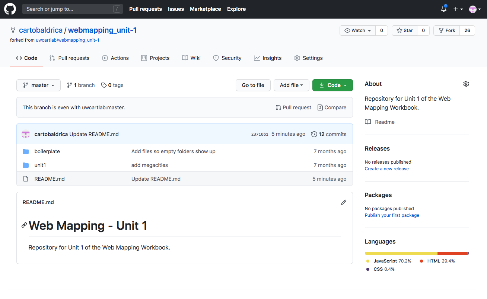
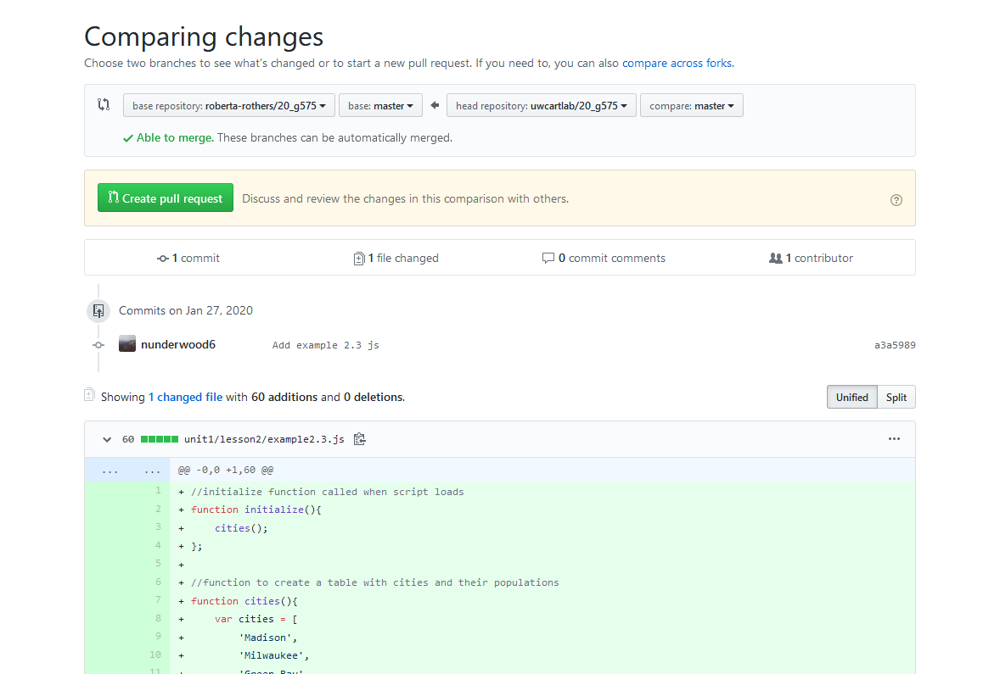
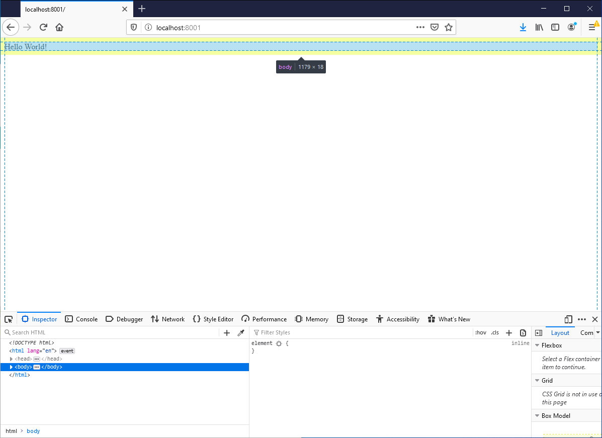
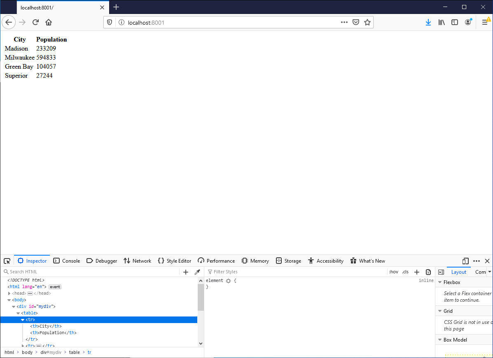
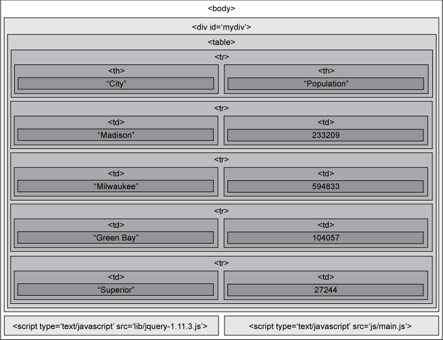
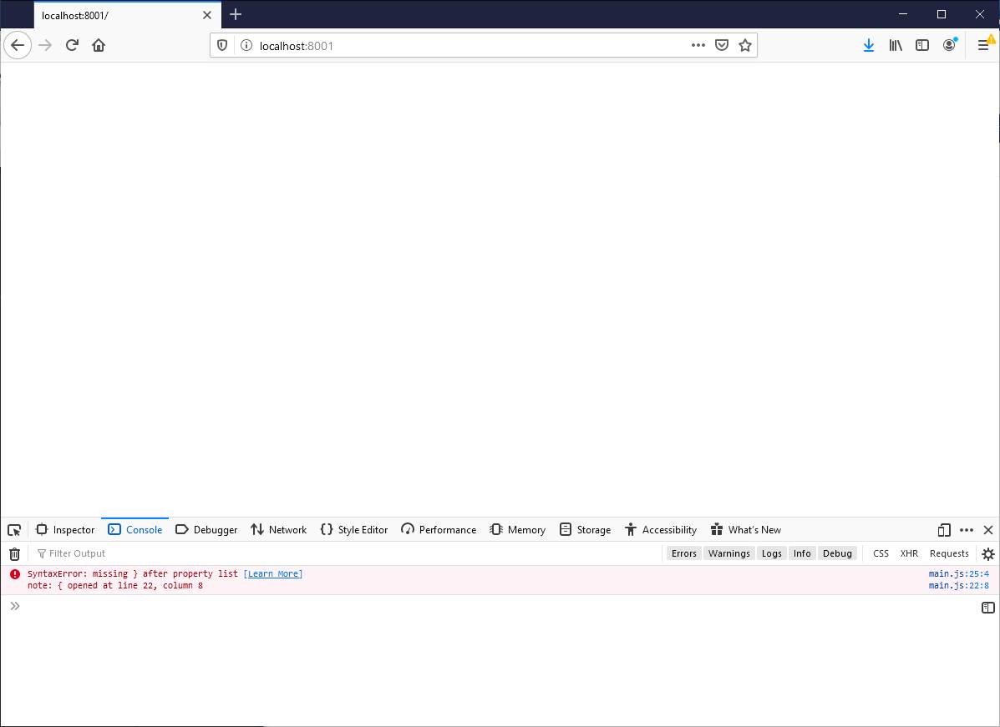
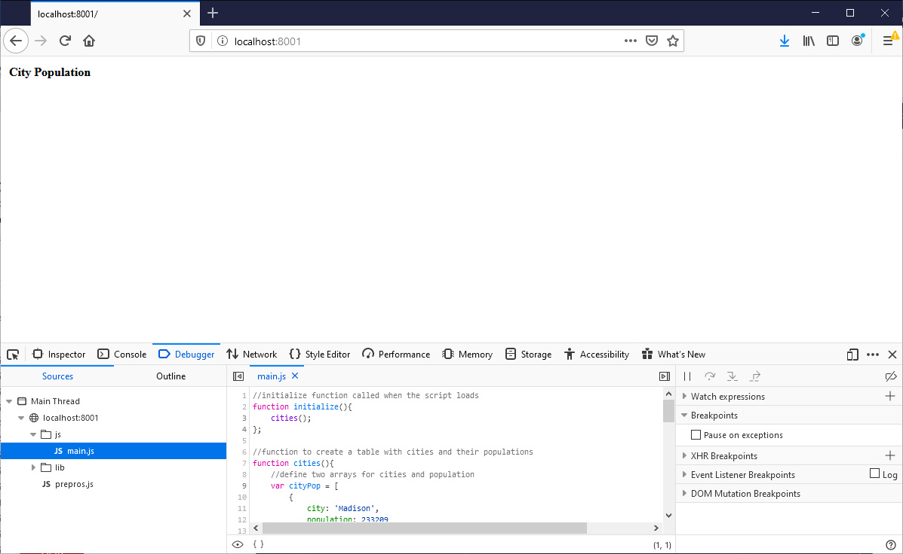

### [Return Home](../../../) | [Previous Chapter](../Chapter2) | [Next Chapter](../Chapter4)

Chapter 3: Scripting and Debugging
=================================

Congratulations on your first successful chapter of Web Cartography and Visualization! You now have created your first Github repo (Activity 1) and completed foundational tutorials for developing on the Open Web (Activity 2). Chapter 3 includes four lab lessons and ends with Activity 3, a debugging exercise to test your knowledge on JavaScript.

*   In Lesson 1, we review the Document Object Model (DOM) and the ways that browsers interpret content on the web.
*   In Lesson 2, we review JavaScript basics, including syntax rules for variables, functions, and the flow of execution. Lessons 1 and 2 are largely review from the Codecademy tutorials.
*   In Lesson 3, we introduce jQuery, a helpful open-source library for efficiently writing JavaScript code.
*   In Lesson 4, we discuss tips and tricks for debugging using the console.

After this chapter, you should be able to:

*   Inspect the Document Object Model (DOM) in any browser
*   Write variables, functions, and control structures in JavaScript
*   Use jQuery to select and manipulate elements in the DOM
*   Use the browser console to debug basic flaws in your code

Getting Started
---------------

Begin Chapter 3 by forking _unit-1_ from the [GitHub course repository](https://github.com/uwcartlab/20_g575). To do so, navigate to the course repository on GitHub and click the "Fork" button in the upper-right corner (Figure 0.1).

As introduced last chapter, _**forking**_ a Github repo creates a copy of an existing repository for personal use, creating a _**branch**_ in the code. Forking typically is used to add functionality or propose changes to the _**main branch**_ of an existing project that you do not control (e.g., you can fork the Leaflet and D3 web mapping libraries we use later in the semester), meaning that cloning your own new project generally is more common than forking an existing project. We will use forking to start each unit from a common repository.

After you fork the repo, you should be able to see _20\_g575_ in your own repository list. A benefit of forking versus cloning is that you can track the changes of the source repository and sync any updates to your own. For example, if we made changes to the _20\_g575_ course repository, an alert will be added to your repository page. For instance, the alert "This branch is 1 commit behind uwcartlab:master" is displayed  in Figure 0.1.

###### Figure 1.1: Forking the _unit-1_ repo from the _20\_g575_ course page.

You can sync an update by clicking the "Compare" button (Figure 0.2). <ins>_**Note:**_</ins> You will not need to merge any updates immediately after forking in Chapter 3, so the following instructions are for reference only.

Clicking the "Compare" button redirects you to the "Comparing Changes" page. You can review new updates by switching the "base repository" to your repository and the "head repository" to the course repository by clicking "switching the base". If there are new updates, click "Create Pull Request" to add the updates to your own, forked repository. Confirm that it is "Okay" to make pull changes and click "Merge pull request" to merge the changes in the course repository into your forked repository.

###### Figure 0.2: Example merging changes in the main branch to a forked branch. This is provided as reference, as you will not need to merge any updates immediately after forking in Chapter 3.

These steps may seem to be a lot of work compared to a simple download, but they allow you to experiment with GitHub's version control system that you will rely on more heavily with the Geography 575 final project. While it is tempting to ignore version control, learning and using it now will save you time in the long-run.

> ### **Fork the _unit-1_ repo from the [course Github page](https://github.com/uwcartlab/20_g575). The repo includes the HTML boilerplate from Chapter 2 and additional code snippets for the Chapter 3 lessons, including your debugging assignment.**

Lesson 1: Exploring the DOM
---------------------------

### I. Introduction to the DOM

The Document Object Model, or _**DOM**_, is the standard tree structure, called the **_DOM tree_**, for organizing objects within a webpage (i.e., a "document"). The DOM is _cross-platform_ and _language-independent_, meaning that it is not a specific language or technology, but a convention on how any language should structure a document. For instance, Figure 1.1 visualizes the DOM tree for the HTML boilerplate introduced in Chapter 2, showing how the DOM tree grows in complexity for even simple webpages. 

###### Figure 1.1: Boilerplate DOM tree

The DOM includes all CSS styles and JavaScript variables, properties, and functions in addition to the HTML elements and their attributes. Importantly, JavaScript and other scripting languages reference objects through the DOM to enable interactivity on the web, including cartographic interaction. Accordingly, interactive web maps would be impossible without the DOM. 

Thus, reading and revising code based on the DOM is a critical skill for efficient web development.

### II. The Inspector

Every browser has a set of **_developer tools_** that support coding on the Open Web. The _**inspector**_ tool identifies a given HTML element within the DOM structure.

You can activate the inspector on any webpage using right-/command-click and selecting "Inspect" or "Inspect Element" (the specific language varies by browser). Activating the inspector opens the _**inspector tab**_ of the developer toolbox along the bottom or the side of the browser. Hovering over an HTML element in the inspector tab highlights the corresponding element in the webpage, also indicating the [margin or padding](https://www.w3schools.com/css/css_boxmodel.asp) associated with the element. You can click the right-facing arrow to open any element in the inspector tab to reveal the next nested level in the DOM. 

If you click the box-arrow icon in the top-left of the inspector tab (a magnifying glass icon in some browsers), you then can hover over the webpage itself and identify the location of the highlighted HTML element in the DOM. Figure 1.2 shows the inspector tab in the Firefox browser, with the `<body>` element selected.

###### Figure 1.2: The Firefox Inspector

You also can activate the inspector through the browser "Tools"/"Developer Tools" menu or the F12 keyboard shortcut. 

> ### **Open the HTML boilerplate in a browser and see how the HTML tree is structured using the inspector.**

The inspector primarily shows the HTML elements contained in the DOM and not the attributes, styles, and scripts also included in the DOM. Most browsers have a _**DOM tab**_ (it will go by different names across browsers) that displays the _entire_ DOM of a webpage, but the added complexity often is difficult to interpret for the purposes of debugging. We will return to additional developer tools in subsequent lessons that facilitate interpretation of other aspects of the DOM.

Lesson 2: JavaScript Basics
---------------------------

### I. Computational Thinking

As introduced in Chapter 2, _**JavaScript**_ is a web programming language for applying dynamic actions or behaviors to webpage content. In other words, JavaScript is the language of interaction on the web. In order to understand JavaScript, as any other scripting language, it is necessary to develop **_computational thinking_** skills, or the ability to think like a computer and work through the steps and processes taking place in a script. Journalist and interactive application developer [Tasneem Raja compares computational thinking to cooking](http://www.motherjones.com/media/2014/06/computer-science-programming-code-diversity-sexism-education):

> "_Like a good algorithm, a good recipe follows some basic principles. Ingredients are listed first, so you can collect them before you start, and there's some logic in the way they are listed:  olive oil before cumin because it goes in the pan first. Steps are presented in order, not a random jumble, with staggered tasks so that you're chopping veggies while waiting for water to boil. A good recipe spells out precisely what size of dice or temperature you're aiming for. It tells you to look for signs that things are working correctly at each stage—the custard should coat the back of a spoon. Opportunities for customization are marked—use twice the milk for a creamier texture—but if any in2gredients are absolutely crucial, the recipe makes sure you know it. If you need to do something over and over—add four eggs, one at a time, beating after each—those tasks are boiled down to one simple instruction_."

Let's think about this analogy in terms of what you should know about JavaScript from the tutorial you completed:

*   _**variables**_ are the recipe ingredients
*   _**functions**_ are the cooking tasks
*   _**syntax rules**_ indicate how to precisely describe and measure each ingredient in the recipe
*   _**console logging**_ is like tasting the food throughout cooking to make small adjustments
*   _**conditional statements**_ indicate how to customize the recipe to different tastes
*   _**loops**_ indicate where to repeat a task

Additionally, _**comments**_ indicate to human readers of the script—including you the programmer, as your memory often is imperfect—how the code works. You should add a comment to the line above any piece of the script that may be indiscernible to others. There is room for judgement about what parts of the script are obvious versus requiring clarification; as you code more, you will get a better idea of where you need to add reminders about how the script works. You also can use comments to temporarily disable parts of the script to isolate code blocks while debugging (more on this later).

Let's build a simple example to explore the logic of JavaScript (Example 2.1).

> ### **Open the HTML boilerplate directory forked from the _unit-1_ repo. Within the `<body>` of your _index.html_ file, add a `
` element with an `id` attribute of `"mydiv"` (do not forget to add a closing `
` tag). Open your _main.js_ file and add the Example 2.1 script. Make sure your _main.js_ file is linked through a `
    

Make sure you add this script link _**above**_ the link to your _main.js_ file in _index.html_, as linked files are read by the browser's interpreter in the order in which they are linked. Otherwise, the code in _main.js_ will not be able to find the jQuery library!

> ### **Add a script link to jQuery in your _index.html_ file.**

Because jQuery is an open-source library, you can open it up and read through it. The jQuery developers made it especially easy to read the development version by using good formatting and heavily commenting throughout, although we do not expect you to understand all of the script for Geography 575.

### II. Method Chaining

The jQuery library essentially is a series of functions that support common tasks. When a function is part of a library, it is generally referred to as a **_method_** of that library. jQuery is somewhat unique in that it supports **_method chaining_**_,_ or the calling of multiple methods in sequence using dot syntax, resulting in simplified code. Example 3.2 shows a two method chain using jQuery.

###### Example 3.2: Method chaining with dot syntax in _main.js_

    jQuery('#mydiv').html('Hello World');
    

The first part of the Example 3.2 method chain is `jQuery('#mydiv')`. This method selects the HTML `
` with the id attribute `'mydiv'` and returns it to the script for manipulation. The second method, `html('Hello World')`, writes the text 'Hello World' to the `
`. The method chain above is functionally equivalent to Example 2.1 above.

You already can start to see why jQuery is so useful. Rather than having to designate a variable to hold the `
` element for processing and use the lengthy `document.getElementById` method, `jQuery('#mydiv')` grabs the element and prepares it for manipulation by other jQuery methods right away.

jQuery also provides alias `$` syntax for its name to further reduce the size of your code (Example 3.3).

###### Example 3.3: Using the `$` alias for jQuery

    $('#mydiv').html('Hello World');
    

jQuery uses a **_selector_** to find the element or elements you want to manipulate. In the case above, we gave our `
` an `id` attribute, which we can access using pound `#` sign, just like in CSS. If we had assigned a `class` attribute to the `
`, we can access it with a `.`, as in `'.mydiv'`. You also can select all elements of a particular tag in the document by using just the tag name with no prefix character, such as `$('div')` to select all div elements.

Note that the selector <ins>**_must be in quotes_**</ins> (single or double) unless it is a variable that holds the string value of the attribute used for the selection, or it is a keyword recognized by jQuery (`document` or `window`). It is good to get in the habit of naming any HTML elements with `id` and/or `class` attributes that you subsequently might want to manipulate in your script or your CSS stylesheet. Keep in mind that each unique `id` value should be used for only one element in the document, whereas `class` is meant to be used to give the same identifier to multiple elements.

> ### **Print "Hello World" to the browser using the jQuery alias and method chaining.**

### III. Adding Elements

Knowing how jQuery syntax works, you now can rewrite the table script using jQuery's `.append()` method, which adds elements to a webpage (Example 3.4):

###### Example 3.4: Building an HTML table in _main.js_ using jQuery

    //initialize function called when the script loads
    function initialize(){
        cities();
    };
    
    //function to create a table with cities and their populations
    function cities(){
        //define two arrays for cities and population
        var cityPop = [
            { 
                city: 'Madison',
                population: 233209
            },
            {
                city: 'Milwaukee',
                population: 594833
            },
            {
                city: 'Green Bay',
                population: 104057
            },
            {
                city: 'Superior',
                population: 27244
            }
        ];
    
        //append the table element to the div
        $("#mydiv").append("<table>");
    
        //append a header row to the table
        $("table").append("<tr>");
    
        //add the "City" and "Population" columns to the header row
        $("tr").append("<th>City</th><th>Population</th>");
    
        //loop to add a new row for each city
        for (var i = 0; i < cityPop.length; i++){
            //assign longer html strings to a variable
            var rowHtml = "<tr><td>" + cityPop[i].city + "</td><td>" + cityPop[i].population + "</td></tr>";
            //add the row's html string to the table
            $("table").append(rowHtml);
        };
    };
    
    //call the initialize function when the document has loaded
    $(document).ready(initialize);
    

Compare the (much shorter) jQuery script in Example 3.4 to our original script in Example 2.3. Note that the strategy for adding elements to the webpage has changed. In the original Example 2.3 script, we first created each element, then added the content to the element, and finally—_only when the element was complete_—added it to the DOM. Thus, the `<table>`—the outermost element—was the very first element created, but the last to be appended, and the only element appended to an existing element in the DOM (the `
`).

jQuery enables a different approach: HTML elements are created _at the same time they are added to the DOM_. The `<table>` element still is the first element we manipulate, but it is _immediately_ appended to the existing `
`. Notice there is no closing `</table>` tag; you could provide one, but jQuery adds this automatically for elements that need it if you do not. Once appended, it then is possible for jQuery to select the table out of the DOM for manipulation.

Continuing with the Example 3.4 code, we append the first table row element `<tr>` directly to the `<table>`, and to that we append the full html string of the header cells. This is just like writing HTML code within _index.html_, except that it is contained within a string and you need not worry about the formatting. Within the loop, we again append an HTML string, this time representing the full row. Note that we could have also done this for the header row, combining the previous two `.append()` methods. Instead of writing our HTML string just as a parameter of the `.append()` method, we first assign it to the variable `rowHtml`. This keeps the code tidier by avoiding a line of script so long that it bleeds off the page (although sometimes this is simply unavoidable). We form the HTML string by concatenating strings of the proper HTML tags with the `cityPop[i].city` and `cityPop[i].population` properties, looping through the `cityPop` array until there are no more objects to append as rows to the table.

At the bottom of the script, we replace `window.onload = intialize()` with `$(document).ready(initialize)`. This will execute the script as soon as the DOM is prepared, before all images and frames are loaded, making the loading of the site faster.

When writing HTML strings, make sure that you add all of the proper closing tags to your elements in the correct order. Unclosed elements may result in a DOM structure you did not anticipate, with odd formatting results. Figure 3.1 visualizes how the HTML elements in your table are organized in the DOM tree.

###### Figure 3.1: The HTML table DOM tree structure

> ### **Update the Example 2.3 code from the forked _unit-1_ repo to use jQuery.**

### IV. More Useful jQuery

As you develop your lab projects, you will use many more jQuery methods. All of jQuery's methods are described in the [jQuery documentation](https://api.jquery.com/). Here we cover several of the more useful jQuery methods for manipulating the DOM. Each of these methods is called on a jQuery selection using dot syntax.

**_[.attr()](http://api.jquery.com/attr/)_**: This method allows you to get or set an attribute of the selected HTML element. It takes one or two parameters: the first parameter is the name of the attribute (e.g., `'id'` or `'class'`), while the second, optional parameter is a value with which to replace that attribute's current value (Example 3.5).

###### Example 3.5: Using `.attr()` in _main.js_

        //Added at Example 3.5 line 44...
        //get the div id
        var theid = $('#mydiv').attr('id');
    
        //theid is 'mydiv'; add it as text to the div
        $('#mydiv').append(theid);
    
        //add the class 'foo' to the div
        $('#mydiv').attr('class', 'foo');
    
        //Check your work with the Inspector!
    

_**[.css()](http://api.jquery.com/css/)**_: This method gets or sets the value of the `style` attribute of the selected element(s) using CSS styles. It is useful for changing element styles dynamically. It will, however, override any styles in your _style.css_ file that apply to the element(s), as in-line styles (those designated through the HTML element `style` attribute) always override styles stored in separate stylesheets. You can either give it the name and value of one style as strings, or change multiple styles at once as an object (Example 3.6).

###### Example 3.6: Using `.css()` in _main.js_

        //Added below Example 3.6...
        //change the text color
        $('#mydiv').css('color', 'red');
    
        //change the text size and alignment
        $('#mydiv').css({
            'font-size': '2em',
            'text-align': 'left'
        });
    
        //get the text color and add it as text to the div
        var thecolor = $('#mydiv').css('color');
        $('#mydiv').append(thecolor);
    
        //fooled ya! thecolor is rgb(255, 0, 0), the CSS interpreter's translation of the keyword 'red'
    

_**[.each()](https://api.jquery.com/each/)**_: This method accepts as its parameter a function that loops through all of the selected elements. This is useful if you need to use individual attribute values of each element or need to assign different values to each element using imported data (Example 3.7).

###### Example 3.7: Using `.each()` in _main.js_

        //Added below Example 3.7...
        //iterate over each script element and add each one's source url as text to the div
        $('script').each(function(){
            var thesource = $(this).attr('src');
            $('#mydiv').append(thesource);
        });
    

Note that `$(this)` inside of the loop selects the current element. You need not use `.each()` if you are assigning the exact same value to a set of selected elements; for that, simply chain the method that does what you want to the selection.

**_[.on()](http://api.jquery.com/on/)_** and _**[.off()](http://api.jquery.com/off/)**_: These are jQuery's standard _**event listener**_ methods that apply actions or behaviors based on user- or system-driven events, similar to JavaScript's native `addEventListener()` and `removeEventListener()` methods. `.on()` usually takes two parameters: the name of the event to be listened for (such as `'click'`, `'mouseover'`, `'mouseout'`, etc.), and an _**event handler**_ function that executes when the event occurs (Example 3.8). `.off()` predictably does the opposite of `.on()`, although you need to provide _exactly the same_ event name and handler function to actually remove the event listener from the element. Thus, while you can provide either method an anonymous function as the second parameter, if you wish to remove the listener it is best to define this function separately and pass the function name to the `.on()` and `.off()` methods. There also are several alias methods available for popular event listeners.

###### Example 3.8: Using `.on()` in _main.js_

        //Added below Example 3.8...
        //click listener with anonymous handler function
        $('table').on('click', function(){
            alert('Madison Rocks! Go Badgers!');
        });
    
        //alias method for the click event listener
        $('table').click(function(){
            alert('Visit Superior and see the big lake!');
        });
    
        //named handler function for removable listener
        function clickme(){
            alert('Yeah Green Bay! Go Packers!');
        };
    
        //add the event listener
        $('table').on('click', clickme);
    
        //remove the event listener
        $('table').off('click', clickme);
    

> ### **Use the jQuery `.attr()`, `.css()`, and `.on()` methods to add properties and events to the HTML elements on your webpage.**

Lesson 4: Debugging in the Developer Console
--------------------------------------------

### I. About Debugging

Despite how hackers are depicted in Hollywood movies, you will spend most of your time debugging code rather than writing code. [Jeffrey Elkner, Alan B. Downey, and Chris Meyers try to put debugging in perspective](http://www.openbookproject.net/thinkcs/python/english2e/ch01.html):

> _"One of the most important skills you will acquire is debugging. Although it can be frustrating, debugging is one of the most intellectually rich, challenging, and interesting parts of programming... In some ways, debugging is like detective work. You are confronted with clues, and you have to infer the processes and events that led to the results you see._

> _"Debugging is also like an experimental science. Once you have an idea what is going wrong, you modify your program and try again. If your hypothesis was correct, then you can predict the result of the modification, and you take a step closer to a working program. If your hypothesis was wrong, you have to come up with a new one. As Sherlock Holmes pointed out, When you have eliminated the impossible, whatever remains, however improbable, must be the truth."_

Or, in the words of the venerable [Douglas Adams](https://en.wikipedia.org/wiki/The_Hitchhiker's_Guide_to_the_Galaxy):

### II. Console Errors

If you have been testing each code example in this chapter's lessons, you probably have run into some unexpected problems. Maybe you accidentally misplaced some punctuation, misspelled or incorrectly capitalized a word, or forgot an essential character. Maybe you copied the code from each example into _main.js_ without removing or commenting out the original Example 2.3 code the new example was intended to replace. Maybe you forgot to update your link to jQuery to the _lib_ folder versus the _js_ folder in _index.html._  Maybe you forgot to preview your changes with Prepros or to clear your cache between refreshes. The list of possible issues goes on and on...

Such difficulties are normal, everyday experiences for every level of programmer, beginner to expert. The trick to overcoming routine errors is learning how to efficiently debug your code as you go. A single wrong character in the script can break your entire webpage, and it requires some sleuthing to find the pointy needle in the haystack. Fortunately, every browser's developer toolset comes with a vital tool that allows us to do just that: the console.

The _**console**_, usually accessed by a tab or button next to the inspector, is where errors and other messages from the scripts are printed. Often, it actually is _more_ convenient for you the developer if your console shows an error, because the console error should tell you exactly where in the script the error is occurring. For instance, say your script failed and you found a syntax error in the console (Figure 4.1).

###### Figure 4.1: A syntax error displayed in the console

The error statement identifies line 25 of your _main.js_ file, where there may be a missing curly brace. Now the problem should be easier to spot in the buggy Example 4.1 code. The object representing the City of Superior requires a closing curly brace before the bracket closes the overall array.

###### Example 4.1: Incorrect syntax in _main.js_

    //Example 3.5 line 6...
    function cities(){
    //define two arrays for cities and population
    var cityPop = [
        { 
            city: 'Madison',
            population: 233209
        },
        {
            city: 'Milwaukee',
            population: 594833
        },
        {
            city: 'Green Bay',
            population: 104057
        },
        {
            city: 'Superior',
            population: 27244
    ]; //this is line 25 of Example 3.4
    

Similarly, perhaps you have an undefined variable that you try to manipulate through JavaScript in the code. The console will display a reference error, noting the particular variable (Figure 4.2).

###### Figure 4.2: A reference error displayed in the console

There are multiple reasons a variable could be undefined, but a very common cause is inconsistent capitalization. The error above happens because in one place the script uses `citypop` and in another it uses `cityPop`. Since the variable was defined as `cityPop`, `citypop` is not recognized.

### III. Process of Elimination

Most errors in the console are explanatory and helpful, but occasionally you will run into an error that is mysterious. For example, while developing the example script we have been using, I ran into an error I had never seen before (Figure 4.3):

###### Figure 4.3: A type error displayed in the console

"TypeError: context is null"? What the what? The Console was telling me that the problem was in jQuery, but rarely does a publicly-distributed code library come with bugs in it. The problem instead was what I was feeding _to_ jQuery through my script, not something in jQuery itself. But annoyingly, the console cannot discriminate where in _your_ script the problem is if the error is thrown by the code library. The way I addressed this issue was to **_comment out_** each jQuery method chain in my script in turn until I found the line that was the culprit. This one was relatively easy to find; it turns out the problem was this statement that I was trying to use `document` as a selector for the jQuery `append()` method (Example 4.2).

###### Example 4.2: Incorrect use of a jQuery method in _main.js_

        $(document).append("<table>");
    

jQuery only accepts `document` as a selector for its `.ready()` method, _not_ for `.append()`. The latter method requires the selection of an existing HTML element. I thus changed the selector to a div reference by id `"#mydiv"` (Example 4.3).

###### Example 4.3: Rectified jQuery method call in _main.js_

        $("#mydiv").append("<table>");
    

This update resolved the issue.

### IV. Console.log

What about an error that causes your script to fail silently? For instance, while I was tinkering with the example script for this lesson, I was able to generate a table with just the headers and no errors in the console (Figure 4.4):

###### Figure 4.4: There's no table, Jim

Example 4.4 shows my original script producing this silent error.

###### Example 4.4: The _main.js_ script drawing an incomplete table without a console error

    //initialize function called when the script loads
    function initialize(){
        cities();
    };
    
    //function to create a table with cities and their populations
    function cities(){
        //define two arrays for cities and population
        var cityPop = [
            { 
                city: 'Madison',
                population: 233209
            },
            {
                city: 'Milwaukee',
                population: 594833
            },
            {
                city: 'Green Bay',
                population: 104057
            },
            {
                city: 'Superior',
                population: 27244
            }
        ];
    
        //append the table element to the div
        $("#mydiv").append("<table>");
    
        //append a header row to the table
        $("table").append("<tr>");
    
        //add the "City" and "Population" columns to the header row
        $("tr").append("<th>City</th><th>Population</th>");
    
        //loop to add a new row for each city
        for (var i = 0; i < cities.length; i++){
            //assign longer html strings to a variable
            var rowHtml = "<tr><td>" + cityPop[i].city + "</td><td>" + cityPop[i].population + "</td></tr>";
            //add the row's html string to the table
            $("table").append(rowHtml);
        };
    };
    
    //call the initialize function when the window has loaded
    $(document).ready(initialize);
    

Can you see the problem? I did not. I could tell from preview that my header row was drawing correctly, but it was as though my loop did not exist. There were a few things that could be going on, so I needed to use a process of elimination to test for different issues. This is where `console.log` comes in handy. This native JavaScript method prints whatever you want to the console, allowing you to make visible what is going on in the script.

Let's debug! First, we can see whether the script is stopping for some reason before it reaches the loop. To do this, we can add a simple `console.log` statement just before the loop to see if it will execute (Example 4.5):

###### Example 4.5: Adding a `console.log` statement to test the execution in _main.js_

        //Example 4.4 line 36...
        console.log("Hello World");
        //loop to add a new row for each city
        for (var i = 0; i < cities.length; i++){
            //assign longer html strings to a variable
            var rowHtml = "<tr><td>" + cityPop[i].city + "</td><td>" + cityPop[i].population + "</td></tr>";
            //add the row's html string to the table
            $("table").append(rowHtml);
        };
    

The results (Figure 4.5):

###### Figure 4.5: The console showing the executed statement

Next, is the problem with the code in the loop or the loop itself? To see if the loop is executing, let's move our `console.log` statement to the first order of business within the loop (Example 4.6):

###### Example 4.6: Move the `console.log` statement inside the loop in _main.js_

        //Example 4.4 line 36...
        //loop to add a new row for each city
        for (var i = 0; i < cities.length; i++){
            console.log("Hello World");
            //assign longer html strings to a variable
            var rowHtml = "<tr><td>" + cityPop[i].city + "</td><td>" + cityPop[i].population + "</td></tr>";
            //add the row's html string to the table
            $("table").append(rowHtml);
        };
    

Result (Figure 4.6):

###### Figure 4.6: The console is blank

Aha! The loop is _not_ executing at all. So let's look at the opening statement of our loop (Example 4.7):

###### Example 4.7: The opening loop statement in _main.js_

        for (var i = 0; i < cities.length; i++){
    

Look carefully at every character in the line for errors with the syntax. There are none (plus the console didn't show a syntax error), so let's look at the variables. The only variable that is not defined within the statement is `cities`. Let's check this variable with a `console.log` statement just above the loop (Example 4.8).

###### Example 4.8: Checking if `cities` is defined in _main.js_

        console.log(cities);
        //loop to add a new row for each city
        for (var i = 0; i < cities.length; i++){
    

Result (Figure 4.7):

###### Figure 4.7:The console showing that `cities` is a function

Notice in the Console that `cities` is a function, not a variable! Thus it is defined, but has no `length` property. If you click the button next to the function name in the console, you can see where in the script the function is defined (Figure 4.8).

###### Figure 4.8: The Debugger tab showing where `cities()` is defined

Why then did I use `cities` in my loop? Remember back to our _very first script_, when we were using two arrays for our data instead of an array of objects (Example 4.9).

###### Example 4.9: Contrasting the former and current array structures in _main.js_

    //THE OLD DATA...Example 4.4 line 6
    function cities(){
        //define two arrays for cities and population
        var cities = [
            'Madison',
            'Milwaukee',
            'Green Bay',
            'Superior'
        ];
        var population = [
            233209,
            594833,
            104057,
            27244
        ];
    
    //THE NEW DATA...Example 4.4 line 6
    function cities(){
        //define two arrays for cities and population
        var cityPop = [
            { 
                city: 'Madison',
                population: 233209
            },
            {
                city: 'Milwaukee',
                population: 594833
            },
            {
                city: 'Green Bay',
                population: 104057
            },
            {
                city: 'Superior',
                population: 27244
            }
        ];
    

I simply forgot to change the name of the variable `cities` to `cityPop` in the loop when I changed the structure of my data. Since both the original `cities` variable and the new `cityPop` variable hold arrays of the same length (4, the number of cities in our data), they should work the same way in a loop statement. We can now fix the loop statement (Example 4.10):

###### Example 4.10: Rectifying the incorrectly referenced variable in _main.js_

        //cities CHANGED TO cityPop...Example 4.4 line 36
        for (var i = 0; i < cityPop.length; i++){
            //assign longer html strings to a variable
            var rowHtml = "<tr><td>" + cityPop[i].city + "</td><td>" + cityPop[i].population + "</td></tr>";
            //add the row's html string to the table
            $("table").append(rowHtml);
        };
    

This might seem like a simple error, but much of debugging involves tediously tracking down simple errors such as this by testing various parts of the script with `console.log` statements. A smart strategy is to add temporary `console.log` statements to check your work every time you write a new piece of code. This way, you know if something is wrong right away and have less script to debug if any problems arise.

## Activity 3

1.  Debug the _main\_with\_debug.js_ script included in the _unit-1_ repo.
2.  Add comments to _main\_with\_debug.js_ explaining what the script is doing at each step.
3.  Create a GitHub repository called _unit-1_. Commit your changes to your _unit-1_ repository and sync with GitHub (you will want to keep your boilerplate site clean for future use). In the commit message (Summary), write "Activity 3" so that we can find it easily on your GitHub account. Your assignment will be graded based on what is contained in this commit. You also must submit  your unit-1 folder as a zip file on Canvas.

_This work is licensed under a [Creative Commons Attribution 4.0 International License](http://creativecommons.org/licenses/by/4.0/).   For more information, please contact Rob Roth \(reroth@wisc.edu\)._

### [Return Home](../../../) | [Previous Chapter](../Introduction) | [Next Chapter](../Chapter3)
