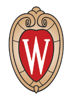

---

# Web Mapping

## _A Workbook for Interactive Cartography and Visualization on the Open Web_

#### [Robert Roth](https://twitter.com/RobertERoth), [Carl Sack](https://twitter.com/northlandiguana), Gareth Baldrica-Franklin, Yuying Chen, [Rich Donohue](https://twitter.com/rgdonohue), [Robin Tolochko](https://twitter.com/tolomaps), [Nick Underwood](https://twitter.com/mulletmapping)

###### Cite/Attribute as: Roth RE, CM Sack, G Baldrica-Franklin, Y Chen, R Donohue, R Tolochko, and N Underwood. 2020. _Web Mapping: A Workbook for Interactive Cartography and Visualization on the Open Web._ Version 0.1. University of Wisconsin Cartography Laboratory: Madison, WI. DOI: 10.5281/zenodo.4009327

---

## About this Workbook

This workbook introduces the practical skills needed to develop interactive maps and visualizations on the open web. Compared to a traditional textbook, this workbook utilizes a "spiral" curriculum of short but interconnected lessons that incrementally build proficiency in interactive cartography and visualization.  

The technological landscape for web mapping and visualization is broad, and this workbook is intended as a partial entry point rather than a comprehensive survey. Specifically, the workbook covers core open source web technologies, including the HTML, CSS, and (in particular) JavaScript languages and the [Leaflet.js](https://leafletjs.com/) and [D3.js](https://d3js.org/) web mapping and visualization libraries. Throughout, Github is used as the primary teaching and learning platform. This workbook is free to use, share, and extend as an open educational resource following a CC-BY license.

The workbook is funded by [NSF CAREER #1555267](https://www.nsf.gov/awardsearch/showAward?AWD_ID=1555267) and is meant to be a living resource updated by the [University of Wisconsin Cartography Lab](https://geography.wisc.edu/cartography/). Version 0.1 is a work-in-progress as we migrate materials to Github, but is stable for classroom instruction. Version 1.0 will be released May 2021.

## Table of Contents

[**Introduction**](/Introduction)

**Unit 1 - Workflows and Data**
- [Chapter 2 - Setting Up Your Workspace](/Chapter2)
- [Chapter 3 - Scripting and Debugging](/Chapter3)
- [Chapter 4 - Data and AJAX](/Chapter4)

**Unit 2 - Designing with Leaflet**
- [Chapter 5 - Leaflet Foundations & Using Online Resources](/Chapter5)
- [Chapter 6 - Dynamic Mapping with Leaflet](/Chapter6)
- [Chapter 7 - The Internal Logic of Leaflet](/Chapter7)
- [Chapter 8 - Collaborating with Github](/Chapter8)

**Unit 3 - Designing with D3**
- [Chapter 9 - D3 Foundations](/Chapter9)
- [Chapter 10 - Mapping in D3](/Chapter10)
- [Chapter 11 - Coordinated Visualizations](/Chapter11)
- [Chapter 12 - Coordinated Interactions](/Chapter12)

## Foundational Knowledge

While this book outlines the fundamental aspects of web cartography and visualization, including coding tutorials, it does assume a basic knowledge of programming concepts. 

- If you do not have any programming experience, we recommend first completing the [Learn How to Code](https://www.codecademy.com/learn/learn-how-to-code) broad overview of programming concepts (~1 hour). 

- If you do not have experience with HTML or want a refresher, we recommend completing Lesson 1 (and only Lesson 1) of the [Introduction to HTML Tutorial](https://www.codecademy.com/learn/learn-html) (~1 hour). 

- If you do not have experience with CSS or want a refresher, we recommend completing Lesson 1 (and only Lesson 1) of the [Introduction to CSS Tutorial](https://www.codecademy.com/learn/learn-css) (~2 hours).

## How to Use this Workbook

This book and its resources can be downloaded directly from Github for individual use. Each Chapter folder contains the chapter content, as well as any data and files referenced.

If you're an instructor using Canvas (or a similar LMS), and want to incorporate  book materials directly into a course site, additional steps are necessary.

1. Download the book.
2. Convert Markdown files to HTML
    1. Each chapter contains one Markdown file with chapter content. To view this information in Canvas, it needs to first be converted to HTML.
    2. Use our [HTML-to-MD](https://uwcartlab.github.io/html-to-md/) tool to convert each Markdown file.
3. Upload HTML to Canvas page
    1. Create a new page in Canvas.
    2. In the top right of the editor, select "HTML Editor"'.
    3. Copy the selected HTML file into the page.
4. Repair image links
    1. Upload all Chapter images (stored in an "img" folder in each Chapter) to Canvas. 
    2. Now, each image will have its own URL on your canvas site.
    3. Replace the relative image links in the HTML with your new uploaded image links. 

_This work is licensed under a [Creative Commons Attribution 4.0 International License](http://creativecommons.org/licenses/by/4.0/).   For more information, please contact Rob Roth \(reroth@wisc.edu\)._
